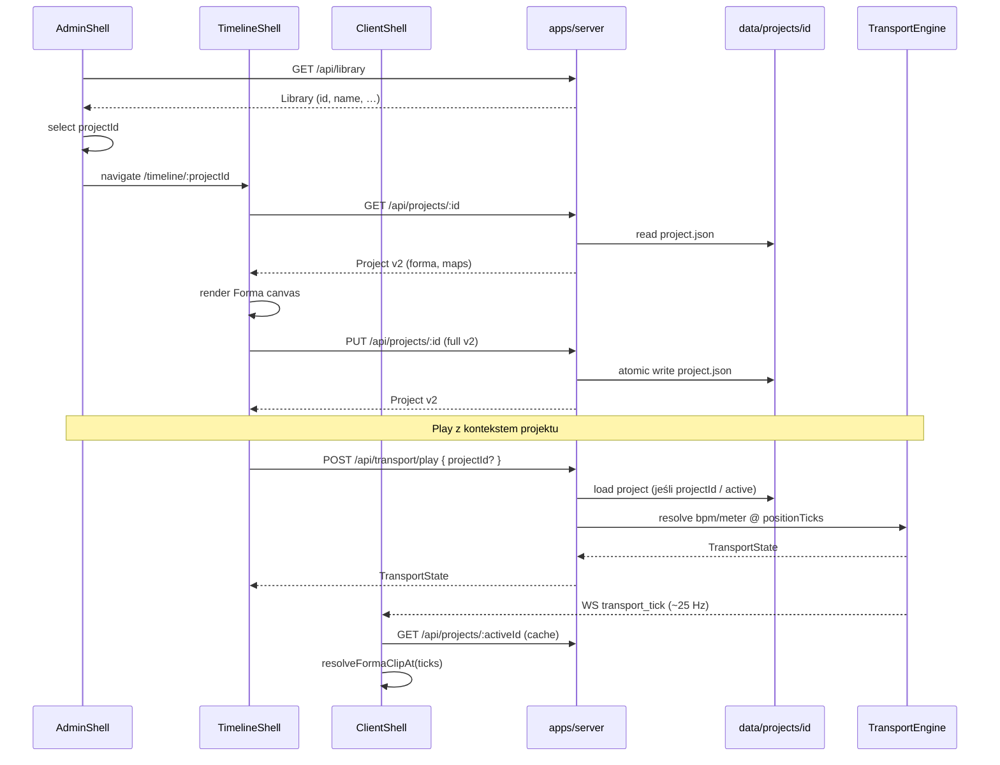

# API flow — alpha.3 (treść + transport z projektu)

Kontrakt bazowy: [`docs/api/README.md`](../../api/README.md).  
Styl JSON: własny dokument domenowy, nie JSON:API ([ADR 0006](../../adr/0006-no-json-api.md)).

## Diagram (docelowy wycinek α3)



## Endpointy — stan α2 vs α3

### Bez zmian kształtu (nadal)

| Metoda | Ścieżka | α3 |
|--------|---------|-----|
| `GET` | `/api/health` | bez zmian |
| `GET` | `/api/library` | bez zmian (indeks name-only) |
| `POST` | `/api/projects` | body `{ name }` → tworzy **v2 seed** |
| `DELETE` | `/api/projects/:id` | bez zmian |
| `GET` | `/api/transport` | snapshot; opcjonalnie + `activeProjectId` |
| `POST` | `/api/transport/pause` | bez zmian |
| `WS` | `/ws/transport` | ticki; te same pola + ewent. `activeProjectId` |

### Zmiany kontraktu (α3)

| Metoda | Ścieżka | Zmiana |
|--------|---------|--------|
| `GET` | `/api/projects/:id` | Response = **ProjectSchema v2** (forma, maps, ppq, …) |
| `PUT` | `/api/projects/:id` | Body = pełny dokument v2 (bez zmiany `id`) **lub** patch z `forma`/`tempoMap`/`meterMap`/`name`; Zod fail-fast |
| `POST` | `/api/transport/play` | Opcjonalne `projectId`; serwer ustawia active + `bpm`/`timeSignature` z map @ current ticks. Body `bpm`/`timeSignature` nadal override (debug). |
| `POST` | `/api/transport/seek` | Po seek: **przelicz** bpm/meter z map aktywnego projektu (jeśli ustawiony) |

### Proponowane rozszerzenie stanu transportu

```ts
TransportState = {
  playing, positionTicks, bpm, timeSignature, ppq,
  activeProjectId?: string | null,
}
```

Alternatywa minimalna (bez pola w state): klient zawsze zna `projectId` z route / local selection i sam podaje przy play — **słabsze** dla Client (wiele kart). Rekomendacja: **`activeProjectId` na serwerze** (SSOT sesji koncertu).

Opcjonalny endpoint (nice-to-have α3, nie blocker):

| Metoda | Ścieżka | Opis |
|--------|---------|------|
| `POST` | `/api/transport/load` | `{ projectId }` — ustawia active, seek 0 lub CD start, apply tempo/meter, bez play |

## Przepływy produktowe

### A. Edycja Formy

1. Admin wybiera utwór → „Otwórz w Timeline” → `/timeline/:projectId`.
2. Timeline `GET` projektu → rysuje clipy Formy w ticks→px.
3. Pencil: insert/overwrite clipów Formy w draftcie lokalnym.
4. Zapisz → `PUT` → atomic write (`writeJsonAtomic`).

### B. Odtwarzanie z metrum projektu

1. Ustaw `activeProjectId` (load lub play z id).
2. `play`: `resolveTempoAt` / `resolveMeterAt` → `engine.play({ bpm, timeSignature })`.
3. `seek`: po zmianie pozycji ponów resolve (tempo changes mid-song).
4. WS ticki niosą aktualne `bpm` / `timeSignature` (już w `TransportState`).

### C. Client — aktywna sekcja

1. Subskrypcja WS + `activeProjectId`.
2. Jednorazowy / cache `GET /api/projects/:id`.
3. `resolveFormaClipAt(displayTicks)` → UI „Intro” / Countdown.
4. Rola `drums` (Forma) i status Admin „Sekcja” korzystają z tego samego resolvera (shared).

## Błędy

Bez zmian: `400` / `404` / `500` → `{ ok: false, error }`.  
Dodatkowo α3:

- Zod v2 fail → 400.
- `projectId` nieistniejący przy play/load → 404.
- `ppq !== 960` → 400 (na alpha).

## Poza API α3

- Import/export paczki, MusicXML, MIDI, setlista, stage message, auth.
- JSON:API / OpenAPI pełne — nie.
- Dual-write legacy `database.json` — zakaz ([ADR 0005](../../adr/0005-domain-axioms.md)).
