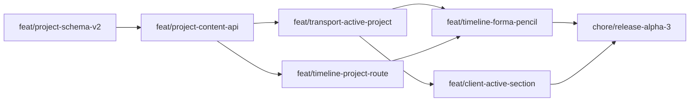

# Plan implementacji — 5.0.0-alpha.3

Workflow: feature z TODO → gałąź `feat/*` + PR ([CONTRIBUTING](../../../CONTRIBUTING.md)).  
Docs/chore mogą iść na `main`; **ten wycinek = seria PR feature**.

## Kolejność PR (zalecana)

| # | Branch | Zakres | Testy min. | Zależności |
|---|--------|--------|------------|------------|
| 1 | `feat/project-schema-v2` | Zod Project v2 + **`.strict()`**; seed CD **−7680/7680**; resolvery; upgrade v1→v2; test unknown keys → fail | Vitest shared | — |
| 2 | `feat/project-content-api` | Storage create/read/update pełny v2; PUT full doc; `docs/api` | `library-crud` + nowe | #1 |
| 3 | `feat/transport-active-project` | `activeProjectId`; play/seek/load z map; reanchor przy zmianie bpm | `transport-api` + engine (mid-play bpm) | #2 |
| 4 | `feat/timeline-project-route` | `Route /timeline/:projectId`; Admin link z id; GET load | smoke web | #2 |
| 5 | `feat/timeline-forma-pencil` | Canvas Formy z danych; pencil; Zapisz PUT; Odrzuć=reload | unit + ręczny | #3, #4 |
| 6 | `feat/client-active-section` | Admin „Sekcja” + Client rola **`drums`**; **should — cut OK** | unit + WS | #3 |
| 7 | `chore/release-alpha.3` | Bump α3, CHANGELOG, wersja w shellach (dziś hardcoded α1) | CI full | must #1–5; #6 opcjonalnie |

**Scalanie PR:** wolno łączyć 4+5 albo 3+6 jeśli mały diff — nie łączyć schema z UI w jednym PR bez potrzeby.

## Pliki / obszary (orientacja)

| Warstwa | Ścieżki |
|---------|--------|
| Shared | `packages/shared/src/schema.ts`, nowe `project-resolve.ts` (lub obok), exporty |
| Server storage | `apps/server/src/storage/index.ts` |
| Server routes | `routes/projects.ts`, `routes/transport.ts`, `transport/engine.ts` |
| Web | `App.tsx` routes; `shells/*`; `lib/libraryApi.ts`; transport provider |
| Docs | `docs/api/README.md`, `docs/TODO.md` (po zrobieniu wykreślić), CHANGELOG |

## Testy — macierz

| Warstwa | Co |
|---------|-----|
| Shared | Seed v2 (−7680 CD); upgrade v1; resolvery; ujemne ticks; **PUT-like parse unknown → throw** |
| Server | POST create ma `forma`; PUT full; play z projectId; seek przez granicę tempa + reanchor |
| Web | (min.) link Admin buduje URL z id; brak crash bez projektu |
| E2E | Opcjonalnie później; α3 nie blokuje się na Playwright |

## Checklista release alpha.3

1. Wszystkie must z [report-scope-alpha3.md](./report-scope-alpha3.md) zmergowane.  
2. `pnpm lint && pnpm check-types && pnpm test && pnpm build` (CI).  
3. Ręcznie: create → open Timeline → pencil → save → reload → play → Client widzi sekcję.  
4. `package.json` version → `5.0.0-alpha.3`.  
5. CHANGELOG: przenieś Unreleased + wpisy α3 (klasyfikacja Dodano).  
6. Tag `v5.0.0-alpha.3` tylko na prośbę właściciela.  
7. Zaktualizuj `docs/TODO.md` / ROADMAP one-liner jeśli trzeba.  
8. **Nie** otwierać migratora / MIDI / audio w tym tagu.

## Estymata (orientacyjna, 1 dev)

| PR | Effort |
|----|--------|
| #1 schema | 0.5–1 d |
| #2 API | 0.5–1 d |
| #3 transport | 0.5–1 d |
| #4 route | 0.25–0.5 d |
| #5 Forma UI | 1.5–3 d (największy) |
| #6 Client | 0.5–1 d |
| #7 release | 0.25 d |

**Razem ~4–8 dni** kalendarzowych — zależnie od głębokości canvas (prosty CSS lane vs „prawie v4”).

## Rekomendowany pierwszy branch

**`feat/project-schema-v2`** — zero UI, odblokowuje API i transport; niski risk review.
