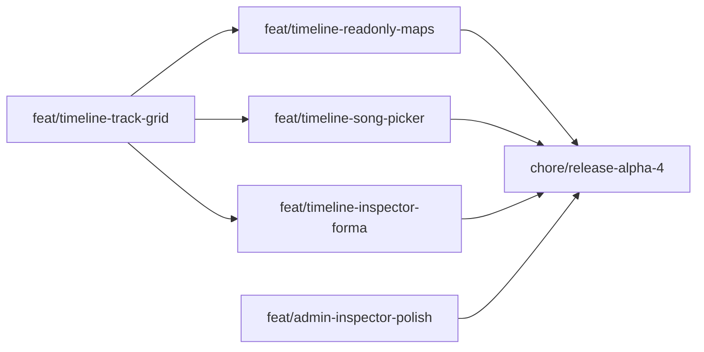

# Plan implementacji — 5.0.0-alpha.4

Workflow: feature z [TODO.md](../../TODO.md) → gałąź `feat/*` + PR ([CONTRIBUTING](../../../CONTRIBUTING.md)).  
Scope: [report-scope-alpha4.md](./report-scope-alpha4.md).

## Kolejność PR (zalecana)

| # | Branch | Zakres | Testy min. | Zależności |
|---|--------|--------|------------|------------|
| 1 | `feat/timeline-track-grid` | Wspólna siatka dock+lanes; eye per ślad; specjalne **nad** treścią; usunąć rozjazd etykiet | smoke manual + opcjonalnie Vitest helper layout | — |
| 2 | `feat/timeline-readonly-maps` | Lane Tempo/Metrum z `tempoMap`/`meterMap`; playhead sync | unit render helper | #1 |
| 3 | `feat/timeline-inspector-forma` | Rename sekcji; CD length; draft → PUT | unit + ręczny | #1 |
| 4 | `feat/timeline-song-picker` | Overlay/modal: fetch library, navigate | libraryApi test | #1 |
| 5 | `feat/admin-inspector-polish` | Empty state „Pliki projektu”; toggle panel na split (should) | smoke | — |
| 6 | `chore/release-alpha.4` | Bump, CHANGELOG, TODO→α5, wersja shelli | CI full | must #1–4 |

**Scalanie PR:** #2+#3 można po #1 jeśli mały diff. **Nie** łączyć track-grid z inspector w jednym PR.

## Pliki / obszary (orientacja)

| Warstwa | Ścieżki |
|---------|--------|
| Web Timeline | `apps/web/src/shells/TimelineShell.tsx`, `TimelineShell.module.css` |
| Web helpers | `apps/web/src/lib/formaCanvas.ts` (ev. lane map render) |
| Web Admin | `apps/web/src/shells/AdminShell.tsx`, `AdminShell.module.css` |
| Docs | `docs/TODO.md`, CHANGELOG |

## Macierz testów

| Warstwa | Co |
|---------|-----|
| Web unit | formaCanvas / map lane helpers; picker URL |
| Web manual | resize okna; eye ukrywa pojedyncze lane; kolejność specjalne↑ treść↓ |
| E2E | OUT α4 (Playwright później) |

## Checklista release alpha.4

1. Must z [report-scope-alpha4.md](./report-scope-alpha4.md).  
2. `pnpm lint && pnpm check-types && pnpm test && pnpm build`.  
3. Ręcznie: picker → Timeline → eye toggles → inspector rename → save → play → sekcja.  
4. `package.json` → `5.0.0-alpha.4`.  
5. CHANGELOG + procedura TODO → alpha.5.  
6. Tag `v5.0.0-alpha.4` tylko na prośbę.

## Estymata (orientacyjna, 1 dev)

| PR | Effort |
|----|--------|
| #1 track grid | 1.5–3 d |
| #2 readonly maps | 0.5–1 d |
| #3 inspector | 0.5–1 d |
| #4 song picker | 0.25–0.5 d |
| #5 admin polish | 0.25–0.5 d |
| #6 release | 0.25 d |

**Razem ~3–6 dni** — #1 dominuje.

## Rekomendowany pierwszy branch

**`feat/timeline-track-grid`** — bez tego każda kolejna funkcja Timeline siedzi na złym layoutcie.
