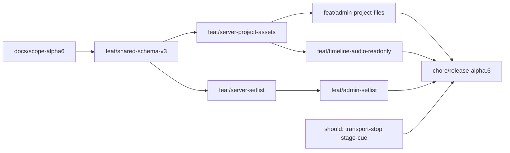

# Plan implementacji — 5.0.0-alpha.6

Workflow: feature z [TODO.md](../../TODO.md) → gałąź `feat/*` + PR ([CONTRIBUTING](../../../CONTRIBUTING.md)).  
Scope: [report-scope-alpha6.md](./report-scope-alpha6.md).

## Kolejność PR (zalecana)

| # | Branch | Zakres | Testy min. |
|---|--------|--------|------------|
| 0 | `docs/report-scope-alpha6` | Scope + plan + ADR 0001/0009 | — |
| 1 | `feat/shared-schema-v3` | Zod v3, upgrade, `projectEndTicks`, setlist pure | Vitest shared |
| 2 | `feat/server-project-assets` | Upload/list/delete/stream; merge-preserve | assets-api.test |
| 3 | `feat/server-setlist` | setlist.json CRUD; auto-advance | setlist tests |
| 4 | `feat/admin-project-files` | Extract `ProjectFilesPanel`; upload UX | smoke + race |
| 5 | `feat/admin-setlist` | Extract `SetView`; footer Dalej/Teraz | smoke |
| 6 | `feat/timeline-audio-readonly` | Load v3 tracks/clips; placeholders | smoke |
| 7–9 | should | Stop, Scena cue, Client empty | cut if timebox |
| 10 | `chore/release-alpha.6` | Bump, CHANGELOG, TODO→α7 | CI full |

## Pliki / obszary

| Warstwa | Ścieżki |
|---------|---------|
| Shared | `packages/shared/src/schema.ts`, `project-seed.ts`, `project-bounds.ts`, `setlist.ts` |
| Server | `storage/paths.ts`, `storage/index.ts`, `routes/projects.ts`, nowe `routes/assets.ts`, `routes/setlist.ts` |
| Web Admin | `AdminShell.tsx`, `shells/admin/*` |
| Web Timeline | `TimelineShell.tsx` |
| Docs | ADR 0001, 0009; TODO; ROADMAP |

## Checklista release

1. Must z scope report.  
2. `pnpm lint && pnpm check-types && pnpm test && pnpm build`.  
3. Smoke gate #1–#6.  
4. `package.json` → `5.0.0-alpha.6`.  
5. CHANGELOG + TODO → alpha.7.  
6. Tag tylko na prośbę.
