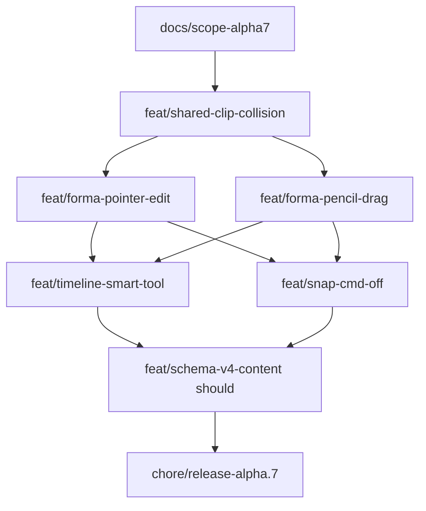

# Plan implementacji — 5.0.0-alpha.7

Workflow: feature z [TODO.md](../../TODO.md) → gałąź `feat/*` + PR ([CONTRIBUTING](../../../CONTRIBUTING.md)).  
Scope: [report-scope-alpha7.md](./report-scope-alpha7.md).

## Kolejność PR (zalecana)

| # | Branch / wycinek | Zakres | Testy min. |
|---|------------------|--------|------------|
| 0 | docs | Scope + plan; ADR 0008 Accepted; ROADMAP link | — |
| 1 | shared-clip-collision | no-overlap + pre-roll≥0 + Countdown | Vitest shared |
| 2 | forma-pointer-edit | move/resize + Delete + preview FSM | forma + gesture |
| 3 | forma-pencil-drag | drag span insert; clamp ≥ 0 | unit + smoke |
| 4 | timeline-smart-tool | tool `smart`; zones Pointer/Smart | smoke |
| 5 | snap-cmd-off | live meta/ctrl na pointermove | unit |
| 6 | schema-v4 + Tekst *(should)* | Zod v4 + lane Tekst MVP | shared + web |
| 7 | release-alpha.7 | Bump, CHANGELOG, QA, TODO→β1 | CI full |

## Pliki / obszary

| Warstwa | Ścieżki |
|---------|---------|
| Shared | `packages/shared/src/clip-collision.ts`, `schema.ts` (v4), `project-seed.ts` |
| Web lib | `formaCanvas.ts`, `timelineGesture.ts`, `formaEdit.ts` |
| Web shell | `TimelineShell.tsx` (+ CSS modules) |
| Client | `clientKaraoke.ts` (linie z `tekst.clips`) |
| Server | `storage/index.ts` — upgrade v3→v4 |
| Docs | ADR 0008; TODO; ROADMAP; QA sign-off |

## Checklista release

1. Must M1–M7 z scope.  
2. `pnpm lint && pnpm check-types && pnpm test && pnpm build`.  
3. Smoke gate #1–#7.  
4. `package.json` → `5.0.0-alpha.7`.  
5. CHANGELOG + TODO → beta.1.  
6. Tag tylko na prośbę.
