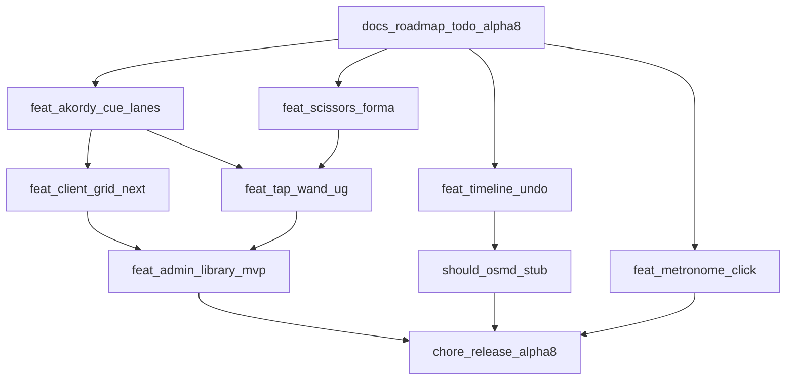

# Plan implementacji — 5.0.0-alpha.8

Workflow: feature z [TODO.md](../../TODO.md) → gałąź `feat/*` + PR ([CONTRIBUTING](../../../CONTRIBUTING.md)).  
Scope: [report-scope-alpha8.md](./report-scope-alpha8.md).  
**Gałąź robocza monorepo:** `feat/alpha-8-v4-parity` (jeden PR zbiorczy OK dla alpha).

## Kolejność (DAG)

| # | Wycinek | Zakres | Testy min. |
|---|---------|--------|------------|
| 0 | docs | Scope + plan; ROADMAP α8/α9/β1; TODO→α8 | — |
| 1 | akordy-cue | Edit + render + collision + inspector | Vitest web |
| 2 | client-grid | Grid z akordów; →następny | unit + smoke |
| 3 | scissors | `splitClipAt` + tool | Vitest shared |
| 4 | tap-wand-ug | Tap + Różdżka + UG Result | Vitest shared/web |
| 5 | undo | `useDraftHistory` / stack | unit |
| 6 | metronome | Web Audio + `resume()` | smoke |
| 7 | admin | Filtr/sort + Scena roles | smoke |
| 8 | osmd *(should)* | Score stub wire | smoke |
| 9 | release | Bump α8, CHANGELOG, QA, TODO→α9 | CI full |

**Równolegle po #0:** #1+#3+#5+#6; **po #1+#3:** #4; **po #1+#2:** #7.

## Pliki / obszary

| Warstwa | Ścieżki |
|---------|---------|
| Shared | `clip-collision.ts` (`splitClipAt`); `ug-import.ts` (parser + Zod Result); `wand.ts`; `ticksToMs` |
| Web lib | `akordyEdit.ts`, `cueEdit.ts`, `draftHistory.ts`, `metronome.ts`, `tapTempo.ts` |
| Web shell | `TimelineShell.tsx`, `ClientShell.tsx`, `AdminShell.tsx` + CSS modules |
| Client | grid pane z `akordy.clips`; setlist next |
| Docs | scope/plan; ROADMAP; TODO; inventarz; QA sign-off |

## Checklista release

1. Must M1–M11 z scope (+ smoke #1–#9).  
2. `pnpm lint && pnpm check-types && pnpm test && pnpm build`.  
3. `package.json` → `5.0.0-alpha.8`.  
4. CHANGELOG + TODO → α9 (migrator).  
5. Tag tylko na prośbę.
