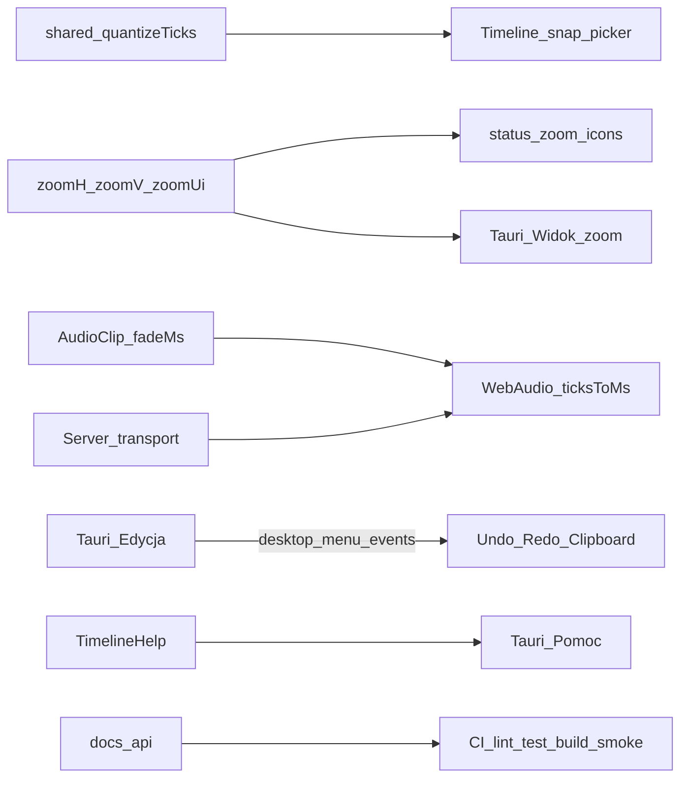

# Scope 5.0.0 — Stabilne wydanie + polish UI / Timeline / audio / Faza D

**Wersja docelowa:** `5.0.0` (tag / bump **tylko na prośbę**; nazwa hero linii 5.0 przy cutcie)  
**Podstawa:** [ROADMAP.md](../../ROADMAP.md) · [TODO.md](../../TODO.md) · [ADR 0002](../../adr/0002-timebase-ssot.md) · [ADR 0005](../../adr/0005-domain-axioms.md) · [ADR 0007](../../adr/0007-snap-grid.md) · [ADR 0008](../../adr/0008-timeline-clip-editing.md) · [ADR 0010](../../adr/0010-desktop-shell-tauri.md) · [ADR 0011](../../adr/0011-ui-parity-behavior.md) · [report-beta-gate.md](./report-beta-gate.md) · [report-scope-beta2.md](./report-scope-beta2.md)  
**Bramka wejścia:** `v5.0.0-beta.2` wydane (2026-07-21); P8 green; start kodu na jawną prośbę (overnight audit 2026-07-21→22)  
**Okno implementacji:** do **10:00** (UTC+2) 2026-07-22 — małe PR-y, **bez merge do `main`**, CI green; G1–G10 = soft-gate (bez HW)

## Cel

Domknąć **stabilne 5.0.0** jako linię produktową (nie kolejny beta feature dump):

1. **Polish UI** na żywych kontrolkach (typografia `--ss-*`, proporcje, copy PL, gęstość) — bez clone chrome v4 ([ADR 0011](../../adr/0011-ui-parity-behavior.md)).
2. **Timeline P1:** zoom H/V z ikonami; Pomoc z pełną treścią; **snap picker** beat/subdivision ([ADR 0007](../../adr/0007-snap-grid.md) faza 2).
3. **Audio polish:** fade, crossfade, loop-region (ewent. overlap) ([ADR 0008](../../adr/0008-timeline-clip-editing.md)).
4. **Desktop OS menu — Faza D:** pełna Edycja; zoom w Widok; rozbudowa Pomoc ([ROADMAP](../../ROADMAP.md)).
5. **`docs/api` domknięte** + CI + smoke E2E (automatyzowalne).
6. **G1–G10:** checklista soft-gate dla operatora rano — **nie** claim green bez HW.

## Kontrakt IN / OUT

| IN 5.0.0 | OUT 5.0.0 |
|----------|-----------|
| Polish UI żywych kontrolek (A) | Motywy / auth / multi-user → **5.1+** |
| Zoom UI H/V + ikony; Help pełny; snap picker (B) | Clone chrome / inventarz-first ([ADR 0011](../../adr/0011-ui-parity-behavior.md)) |
| Fade / crossfade / loop-region; ewent. overlap (C) | Flex Time / stretch / pencil audio / MIDI w Tauri |
| Menu OS Faza D (D) | Android shell / store auto-update |
| `docs/api` + CI + smoke E2E (E) | git-apply (nigdy) |
| Soft-gate G1–G10 (docs checklist; HW = operator) | Fałszywy green G1–G10 w CI |
| Tag `5.0.0` + nazwa hero | Tag/bump **bez** prośby użytkownika |

## IN (must) — A: Polish UI

Źródło: [TODO](../../TODO.md) · [ui-density](../../../.cursor/rules/ui-density.mdc) · [ADR 0011](../../adr/0011-ui-parity-behavior.md).

| # | Wycinek | Uwagi |
|---|---------|--------|
| A1 | Audyt żywych kontrolek Timeline / Admin / Client | Transport, status zoom, dock, inspector, Admin Live Desk |
| A2 | Typografia / spacing wyłącznie `--ss-*` | Brak ad-hoc `font-size` px / HEX w shellach |
| A3 | Copy PL + proporcje / gęstość | Parity = zachowanie, nie ikony |
| A4 | Bez nowych wariantów `Button` | Zamknięty zbiór 7 stanów |

**Powierzchnie (orientacja):** `TimelineShell.tsx` (+ module CSS), Admin (`SetView` / `StageView` / Host), Client shells, `packages/ui` tokeny.

## IN (must) — B: Timeline zoom / Help / snap picker

Źródło: [ADR 0007](../../adr/0007-snap-grid.md) faza 2 · ROADMAP § Alpha 4 odłożone · `TimelineShell` (stan `zoomH`/`zoomV`/`zoomUi` już istnieje — suwaki tekstowe H/V/UI).

| # | Wycinek | Uwagi |
|---|---------|--------|
| B1 | Zoom H/V (+ UI) z **ikonami** przy suwakach / +/- | Reuse `apps/web/src/shells/icons.tsx`; bez narzędzia lupy (OUT α8) |
| B2 | Snap picker UI: `off` / `bar` / `beat` / `subdivision` | Sesja Timeline (+ opcjonalnie localStorage); default `bar`; Cmd/Ctrl = chwilowy off (już α7) |
| B3 | Pomoc Timeline — pełna treść | Rozszerzyć `TimelineHelp.tsx` (audio β2, MIDI host, snap picker, Faza D skróty); bez emoji chrome |
| B4 | Wiring snap mode → `quantizeTicks` / edycja | Stan React; nie zapis w `project.json` (ADR 0007) |

## IN (must) — C: Audio polish (fade / crossfade / loop-region)

Źródło: [ADR 0008](../../adr/0008-timeline-clip-editing.md) §1, §4, §6, §9 · schema `AudioClipSchema` (dziś: trim/gain/mute, **bez** fade).

| # | Wycinek | Uwagi |
|---|---------|--------|
| C1 | Schema: `fadeInMs` / `fadeOutMs` (ew. crossfade pair) | Zod na krawędzi; fail-fast; bump formatu wg ADR 0009 jeśli potrzeba |
| C2 | Playback: envelope fade przy WebAudio scheduler | Pozycja z ticków serwera (`ticksToMs`); bez zegara muzycznego klienta |
| C3 | UI: Smart zones górne narożniki = fade handles | Pointer/Smart; bez pencil audio |
| C4 | Crossfade przy styku / overlap mode (opcjonalnie) | Jeśli czas: minimalny overlap + X-fade; inaczej defer z notatką w handoff |
| C5 | Loop-region audio (clip loop) vs transport cycle | Rozróżnić: transport loop (już jest) vs **loop-region klipu**; must = clip loop-region per ADR |
| C6 | Testy shared + smoke playback | Czyste funkcje; bez `Date.now()` w konwersji domenowej |

## IN (must) — D: Desktop OS menu Faza D

Źródło: [ROADMAP](../../ROADMAP.md) § Desktop OS menu · `apps/desktop/src-tauri/src/lib.rs` (A+B+C done; **brak** submenu Edycja; Widok bez zoom; Pomoc = docs/issues).

| # | Wycinek | Uwagi |
|---|---------|--------|
| D1 | **Edycja:** Undo / Redo / Cut / Copy / Paste / Delete | Mostek `stagesync:desktop-menu` → istniejące commandy Timeline; **bez** disabled „na zapas”; gdy brak stacka — disable tylko realnie |
| D2 | **Widok:** Zoom in / out / reset (H lub UI) | Event → handlery zoom w Timeline (już `zoomHorizontalBySteps` / UI) |
| D3 | **Pomoc:** skróty / overlay pomocy / rozbudowa | Otwórz Timeline Help; ewentualnie PDF setlisty / archiwum jeśli API gotowe — inaczej OUT z checklistą |
| D4 | Zero MIDI / clock w Rust | Shell tylko mostkuje; SSOT = `apps/server` |

## IN (must) — E: docs/api + CI + smoke E2E

Źródło: [docs/api/README.md](../../api/README.md) (nieaktualne: v2, brak MIDI / setlist / assets / desktop paths).

| # | Wycinek | Uwagi |
|---|---------|--------|
| E1 | Domknięcie `docs/api` do stanu β2+ | REST + WS: projects v3+, transport Countdown, MIDI, setlist, assets, OCC `details` |
| E2 | CI: utrzymać green `lint-types-test-build` (+ compose / tauri-check) | Fix regresji w PR-ach A–D |
| E3 | Smoke E2E (automatyzowalne) | Minimalny smoke: health + transport play/stop **lub** Playwright Forma drag jeśli infra gotowa; nie blokować tagu brakiem pełnego browser matrix |

## Soft-gate — G1–G10 (operator; poza oknem HW)

**Brak dostępu do HW w overnight.** Nie zaznaczamy green.

| ID | Status w tym oknie | Akcja overnight |
|----|--------------------|-----------------|
| G1–G10 | ⬜ residual operatorski po β2 | Checklista + sekwencja w [report-beta-gate.md](./report-beta-gate.md); link z TODO; **bez** fałszywego `[x]` |
| G6 kod | prerequisites CI/Release done (darwin+windows `latest.json`) | Bez claim relaunch green |
| Przed tagiem `5.0.0` | Must green na instalatorach β2 (lub artefaktach 5.0.0 RC) | Operator rano |

Zob. sekcja „Sekwencja weryfikacji” w [report-beta-gate.md](./report-beta-gate.md) — baseline `v5.0.0-beta.2`.

## OUT (świadome)

| Temat | Etap |
|-------|------|
| Motywy / auth / multi-user | **5.1+** |
| Android / store auto-update | Poza 5.0.0 |
| MIDI I/O w procesie Tauri | **Nigdy** ([ADR 0010](../../adr/0010-desktop-shell-tauri.md)) |
| Flex Time / pencil audio / stretch poza plik | OUT |
| Clone chrome v4 | **Zakaz** ([ADR 0011](../../adr/0011-ui-parity-behavior.md)) |
| git-apply | Nigdy ([ADR 0004](../../adr/0004-updates-docker.md)) |
| Tag/bump `5.0.0` bez prośby | Zakaz overnight |
| Merge PR → `main` przez agenta | Zakaz — user rano |

## Should (jeśli czas po must A–E)

| Temat | Uwagi |
|-------|--------|
| Doprecyzowanie ADR 0002 (tempo/metrum pre-roll) | Docs-only jeśli otwarte |
| E2E Forma drag + transport (carry z β1) | Po E3 bazowym |
| Admin panel toggle UX | Drobne |
| AD-01…03 Transpozycja / Lead / Edycja zdalna | Pull-forward tylko jeśli pull |

## Weryfikacja vs ADR / ROADMAP (zero sprzeczności)

| Aksjomat | Status w tym scope |
|----------|-------------------|
| SSOT czasu = serwer; klient wygładza między tickami ([ADR 0002](../../adr/0002-timebase-ssot.md)) | ✓ C2, D4 |
| Kanon = integer ticks + PPQ; ms na krawędzi audio | ✓ C* |
| Snap faza 2 = UI picker; default `bar`; nie w `project.json` ([ADR 0007](../../adr/0007-snap-grid.md)) | ✓ B2, B4 |
| Fade/crossfade/loop-region = 5.0.0; no pencil audio ([ADR 0008](../../adr/0008-timeline-clip-editing.md)) | ✓ C* |
| MIDI / clock nie w Tauri ([ADR 0010](../../adr/0010-desktop-shell-tauri.md)) | ✓ D4, OUT |
| Faza D = 5.0.0 ([ROADMAP](../../ROADMAP.md)) | ✓ D* |
| Parity = zachowanie, nie clone ([ADR 0011](../../adr/0011-ui-parity-behavior.md)) | ✓ A*, B1 |
| G1–G10 = operator HW; CI nie zastępuje | ✓ soft-gate |

## Architektura (domyślna)

## Plan PR (małe; 1 temat = 1 PR; kolejność A→B→C→D→E)

| PR | Branch (propozycja) | Temat | Acceptance (smoke) |
|----|---------------------|-------|-------------------|
| **0** | `docs/scope-5.0.0` → `main` (docs OK) | Ten raport + soft-gate note + link w TODO | Plik w `docs/analysis/reports/`; TODO linkuje |
| **A1** | `feat/ui-polish-live-controls` | Polish UI żywych kontrolek (slice Timeline + transport/status) | Brak regresji layoutu; tokeny `--ss-*`; visual smoke |
| **B1** | `feat/timeline-zoom-icons` | Zoom H/V/UI z ikonami | Suwaki + ikony; skróty zoom działają |
| **B2** | `feat/timeline-snap-picker` | Snap picker ADR 0007 faza 2 | Picker zmienia tryb; pencil/drag używa trybu; Cmd-off OK |
| **B3** | `feat/timeline-help-full` | Pełna treść Pomocy | Overlay pokrywa audio/MIDI/snap/zoom |
| **C1** | `feat/audio-fade-schema-playback` | Schema fade + playback envelope | Vitest shared; play z fadeIn/Out |
| **C2** | `feat/audio-fade-ui-loop` | Fade handles UI + loop-region clip (+ overlap jeśli czas) | Gest Smart; persist draft |
| **D1** | `feat/desktop-menu-phase-d` | Menu Edycja + zoom Widok + Pomoc | Eventy → UI; cargo check |
| **E1** | `docs/api-closeout-5.0.0` | Domknięcie `docs/api` | README zgodny z serwerem |
| **E2** | `test/smoke-e2e-5.0.0` | Smoke E2E / CI hook | Job lub skrypt green w CI |

**Zasady PR:** bez merge przez agenta; push `-u`; CI do green follow-up commitami; nie force-push; nie tagować `5.0.0`.

### Soft-gate docs (PR 0 lub osobny chore)

- Aktualizacja [report-beta-gate.md](./report-beta-gate.md): sekcja „Przed 5.0.0 / soft-gate overnight” — G1–G10 nadal ⬜; lista artefaktów β2; zakaz claim green.
- TODO: odhaczyć „Scope report…” po merge PR 0; G1–G10 zostaje otwarte.

## Kryteria zamknięcia etapu (przy tagu — tylko na prośbę)

1. Must A–E merged + CI green na `main`.
2. G1–G10 green **operator** na HW (lub świadomy waiver w report-beta-gate).
3. Bump `5.0.0` + CHANGELOG + **nazwa hero** linii 5.0 + tag `v5.0.0`.
4. TODO → sekcja `5.1` (procedura w TODO.md).

## Handoff morning (2026-07-22 — overnight; update ~07:20 CEST)

**Audit działa.** Agent: bez merge do `main`; bez tagu `5.0.0`; G1–G10 **nie** green. Okno do **10:00 UTC+2**.

### Must A–E (#53–#60)

Wszystkie **OPEN + CI green** (sprawdzone ~06:32 / ponownie w trakcie fali). Merge order: #53→#54; #57→#58 before #64/#66.

### Wave 16 — post-must (~06:36–07:20 CEST) — ten agent

| # | Temat | URL |
|---|--------|-----|
| [#266](https://github.com/Negatywistyczny/stagesync/pull/266) | Timeline song picker filter | https://github.com/Negatywistyczny/stagesync/pull/266 |
| [#267](https://github.com/Negatywistyczny/stagesync/pull/267) | Drums note maxLength 500 | https://github.com/Negatywistyczny/stagesync/pull/267 |
| [#268](https://github.com/Negatywistyczny/stagesync/pull/268) | ProjectFiles stale reload | https://github.com/Negatywistyczny/stagesync/pull/268 |
| [#269](https://github.com/Negatywistyczny/stagesync/pull/269) | Desktop setlist neighbor pending + toast | https://github.com/Negatywistyczny/stagesync/pull/269 |
| [#270](https://github.com/Negatywistyczny/stagesync/pull/270)–[#271](https://github.com/Negatywistyczny/stagesync/pull/271) | Admin/Timeline fullscreen errors | https://github.com/Negatywistyczny/stagesync/pull/270 |
| [#272](https://github.com/Negatywistyczny/stagesync/pull/272) | Client name modal Escape | https://github.com/Negatywistyczny/stagesync/pull/272 |
| [#274](https://github.com/Negatywistyczny/stagesync/pull/274) | ProjectFiles delete confirm pending | https://github.com/Negatywistyczny/stagesync/pull/274 |
| [#276](https://github.com/Negatywistyczny/stagesync/pull/276) | Stage send aria-live | https://github.com/Negatywistyczny/stagesync/pull/276 |
| [#277](https://github.com/Negatywistyczny/stagesync/pull/277) | Desktop play/stop toast (rebase w/#269) | https://github.com/Negatywistyczny/stagesync/pull/277 |
| [#278](https://github.com/Negatywistyczny/stagesync/pull/278) | MusicXML/Batch PC dismiss while busy | https://github.com/Negatywistyczny/stagesync/pull/278 |
| [#279](https://github.com/Negatywistyczny/stagesync/pull/279) | ShellBlockingDialog focus trap (rebase w/#274) | https://github.com/Negatywistyczny/stagesync/pull/279 |
| [#280](https://github.com/Negatywistyczny/stagesync/pull/280) | Forma default subsections max 64 | https://github.com/Negatywistyczny/stagesync/pull/280 |
| [#281](https://github.com/Negatywistyczny/stagesync/pull/281) | Library export Zod body | https://github.com/Negatywistyczny/stagesync/pull/281 |
| [#282](https://github.com/Negatywistyczny/stagesync/pull/282) | Library import orphan delete | https://github.com/Negatywistyczny/stagesync/pull/282 |
| [#283](https://github.com/Negatywistyczny/stagesync/pull/283) | Batch MIDI assignments max 1024 | https://github.com/Negatywistyczny/stagesync/pull/283 |
| [#284](https://github.com/Negatywistyczny/stagesync/pull/284) | Transport mutation mutex | https://github.com/Negatywistyczny/stagesync/pull/284 |
| [#285](https://github.com/Negatywistyczny/stagesync/pull/285) | Asset file stream errors | https://github.com/Negatywistyczny/stagesync/pull/285 |
| [#286](https://github.com/Negatywistyczny/stagesync/pull/286) | sppToTicks MIDI 14-bit range | https://github.com/Negatywistyczny/stagesync/pull/286 |
| [#287](https://github.com/Negatywistyczny/stagesync/pull/287) | Countdown digit labels max 32 | https://github.com/Negatywistyczny/stagesync/pull/287 |
| [#288](https://github.com/Negatywistyczny/stagesync/pull/288) | Tap-tempo BPM 20–400 | https://github.com/Negatywistyczny/stagesync/pull/288 |
| [#289](https://github.com/Negatywistyczny/stagesync/pull/289) | Log SSE history replay errors | https://github.com/Negatywistyczny/stagesync/pull/289 |
| [#290](https://github.com/Negatywistyczny/stagesync/pull/290) | updateAvailable SemVer gt | https://github.com/Negatywistyczny/stagesync/pull/290 |
| [#291](https://github.com/Negatywistyczny/stagesync/pull/291) | Map segments leading default gap | https://github.com/Negatywistyczny/stagesync/pull/291 |
| [#293](https://github.com/Negatywistyczny/stagesync/pull/293) | UG altered chords (Am7b5…) | https://github.com/Negatywistyczny/stagesync/pull/293 |
| [#294](https://github.com/Negatywistyczny/stagesync/pull/294) | Tekst/Cue -r remnant text | https://github.com/Negatywistyczny/stagesync/pull/294 |
| [#295](https://github.com/Negatywistyczny/stagesync/pull/295) | upsertTempoAt BPM 20–400 | https://github.com/Negatywistyczny/stagesync/pull/295 |
| [#296](https://github.com/Negatywistyczny/stagesync/pull/296) | Skip 169.254 LAN addresses | https://github.com/Negatywistyczny/stagesync/pull/296 |

Earlier overnight (#194–#265) + musts: prefer latest handoff tables; do not reimplement.

### Merge / rebase notes (wave 16)

- Desktop toast: unify **#269** + **#277** into one menu-error state.
- **#274** `pending` vs **#279** focus trap on `ShellBlockingDialog`.
- Asset stream **#285** vs upload PRs **#175**/**#186**.
- Prefer **#102** over **#92**; C-fade **#57→#58** before **#64/#66**.

### Remaining backlog (ranked)

1. Continue small 1-theme PRs to ~10:00; fix any red CI.
2. Wand floor length shrink (rebase on #102).
3. Client setlist focus/poll generation after #143 lands.
4. Admin density deep-pass; Client clamps (#90/#198).
5. Playwright Forma drag — defer (#67 exists).
6. G1–G10 — soft-gate only (no HW green claim).

### Blokery

- G1–G10 soft-gate only — **nie** claim green bez HW.
- No merge / no `5.0.0` tag without explicit ask.

## Handoff morning (2026-07-22 — overnight; update ~00:53 CEST)

**Agent:** bez merge do `main`; bez tagu `5.0.0`; G1–G10 **nie** green. Okno do **10:00 UTC+2**.

### Must A–E (#53–#60) — CI green

| # | Temat | URL |
|---|--------|-----|
| [#53](https://github.com/Negatywistyczny/stagesync/pull/53)–[#60](https://github.com/Negatywistyczny/stagesync/pull/60) | A→E musts | merge order: #53→#54; #57→#58 |

### Wave 2+ open PRs (CI ~00:50)

| # | Temat | URL | CI | base |
|---|--------|-----|----|------|
| [#64](https://github.com/Negatywistczny/stagesync/pull/64) | feat(web): add smart-tool audio fade handles on timeline | https://github.com/Negatywistczny/stagesync/pull/64 | green | `main` |
| [#65](https://github.com/Negatywistczny/stagesync/pull/65) | docs(adr): clarify tempo and meter resolution during pre-roll | https://github.com/Negatywistczny/stagesync/pull/65 | green | `main` |
| [#66](https://github.com/Negatywistczny/stagesync/pull/66) | feat(audio): abut crossfade helper and inspector action | https://github.com/Negatywistczny/stagesync/pull/66 | green | `main` |
| [#67](https://github.com/Negatywistczny/stagesync/pull/67) | test(server): smoke Forma put + seek + transport | https://github.com/Negatywistczny/stagesync/pull/67 | green | `main` |
| [#68](https://github.com/Negatywistczny/stagesync/pull/68) | fix(ui): touch targets 36/44 via density tokens | https://github.com/Negatywistczny/stagesync/pull/68 | green | `main` |
| [#69](https://github.com/Negatywistczny/stagesync/pull/69) | fix(web): wire [ / ] setlist navigation keys | https://github.com/Negatywistczny/stagesync/pull/69 | green | `main` |
| [#70](https://github.com/Negatywistczny/stagesync/pull/70) | fix(shared): soft-clock loop wrap between ticks | https://github.com/Negatywistczny/stagesync/pull/70 | green | `main` |
| [#71](https://github.com/Negatywistczny/stagesync/pull/71) | fix(server): lock getLibrary cold seed path | https://github.com/Negatywistczny/stagesync/pull/71 | green | `main` |
| [#72](https://github.com/Negatywistczny/stagesync/pull/72) | fix(web): clearer OCC 409 save conflict message | https://github.com/Negatywistczny/stagesync/pull/72 | green | `main` |
| [#73](https://github.com/Negatywistczny/stagesync/pull/73) | feat(server): setlist auto-advance at song end | https://github.com/Negatywistczny/stagesync/pull/73 | green | `main` |
| [#74](https://github.com/Negatywistczny/stagesync/pull/74) | fix(admin): honest Partytura link and backup copy | https://github.com/Negatywistczny/stagesync/pull/74 | green | `main` |
| [#75](https://github.com/Negatywistczny/stagesync/pull/75) | fix(web): Forma scissors split under pointer on lane | https://github.com/Negatywistczny/stagesync/pull/75 | green | `main` |
| [#76](https://github.com/Negatywistczny/stagesync/pull/76) | fix(web): ClientShell font-weight and pill token hygiene | https://github.com/Negatywistczny/stagesync/pull/76 | green | `main` |
| [#77](https://github.com/Negatywistczny/stagesync/pull/77) | fix(server): write project file before library on create | https://github.com/Negatywistczny/stagesync/pull/77 | green | `main` |
| [#78](https://github.com/Negatywistczny/stagesync/pull/78) | fix(transport): REST responses include serverTimeMs | https://github.com/Negatywistczny/stagesync/pull/78 | green | `main` |
| [#79](https://github.com/Negatywistczny/stagesync/pull/79) | fix(web): Kotwice bar↔ticks walks meter map | https://github.com/Negatywistczny/stagesync/pull/79 | green | `main` |
| [#80](https://github.com/Negatywistczny/stagesync/pull/80) | fix(server): scrub countdown digits on project write | https://github.com/Negatywistczny/stagesync/pull/80 | green | `main` |
| [#81](https://github.com/Negatywistczny/stagesync/pull/81) | fix(server): health version ignores workspace 0.0.0 | https://github.com/Negatywistczny/stagesync/pull/81 | green | `main` |
| [#82](https://github.com/Negatywistczny/stagesync/pull/82) | feat(admin): collapse Utwory inspector panel | https://github.com/Negatywistczny/stagesync/pull/82 | green | `main` |
| [#83](https://github.com/Negatywistczny/stagesync/pull/83) | feat(server): guard LAN restart/shutdown endpoints | https://github.com/Negatywistczny/stagesync/pull/83 | green | `main` |
| [#84](https://github.com/Negatywistczny/stagesync/pull/84) | fix(web): help lane chips without status rainbow | https://github.com/Negatywistczny/stagesync/pull/84 | no-checks | `feat/timeline-help-visual` |
| [#85](https://github.com/Negatywistczny/stagesync/pull/85) | fix(server): PUT must not resurrect deleted audio clips | https://github.com/Negatywistczny/stagesync/pull/85 | green | `main` |
| [#86](https://github.com/Negatywistczny/stagesync/pull/86) | fix(web): guard overlapping transport commands | https://github.com/Negatywistczny/stagesync/pull/86 | green | `main` |
| [#87](https://github.com/Negatywistczny/stagesync/pull/87) | fix(shared): reject invalid meters like 4/7 at Zod edge | https://github.com/Negatywistczny/stagesync/pull/87 | green | `main` |
| [#88](https://github.com/Negatywistczny/stagesync/pull/88) | fix(shared): unique clip ids for split remnants | https://github.com/Negatywistczny/stagesync/pull/88 | green | `main` |
| [#89](https://github.com/Negatywistczny/stagesync/pull/89) | fix(midi): SPP + Continue on seek while playing | https://github.com/Negatywistczny/stagesync/pull/89 | green | `main` |
| [#90](https://github.com/Negatywistczny/stagesync/pull/90) | fix(ui): add client stage typography tokens | https://github.com/Negatywistczny/stagesync/pull/90 | green | `main` |
| [#91](https://github.com/Negatywistczny/stagesync/pull/91) | fix(shared): reject placeClipNoOverlap into Countdown | https://github.com/Negatywistczny/stagesync/pull/91 | green | `main` |
| [#92](https://github.com/Negatywistczny/stagesync/pull/92) | fix(web): honest Timeline Help for hidden wand | https://github.com/Negatywistczny/stagesync/pull/92 | green | `main` |
| [#93](https://github.com/Negatywistczny/stagesync/pull/93) | fix(shared): clamp BPM to 20–400 at Zod edge | https://github.com/Negatywistczny/stagesync/pull/93 | green | `main` |
| [#94](https://github.com/Negatywistczny/stagesync/pull/94) | fix(server): unique temp names for atomic JSON writes | https://github.com/Negatywistczny/stagesync/pull/94 | green | `main` |
| [#95](https://github.com/Negatywistczny/stagesync/pull/95) | fix(admin): replace path picker stub with data-dir readout | https://github.com/Negatywistczny/stagesync/pull/95 | green | `main` |
| [#96](https://github.com/Negatywistczny/stagesync/pull/96) | fix(shared): make Library and Setlist schemas strict | https://github.com/Negatywistczny/stagesync/pull/96 | green | `main` |
| [#97](https://github.com/Negatywistczny/stagesync/pull/97) | fix(web): polish audio inspector control labels | https://github.com/Negatywistczny/stagesync/pull/97 | green | `main` |
| [#98](https://github.com/Negatywistczny/stagesync/pull/98) | fix(shared): meter-map-aware ticks↔BBT for Timeline | https://github.com/Negatywistczny/stagesync/pull/98 | green | `main` |
| [#99](https://github.com/Negatywistczny/stagesync/pull/99) | fix(admin): persist Aktywny set immediately like auto-advance | https://github.com/Negatywistczny/stagesync/pull/99 | green | `main` |
| [#100](https://github.com/Negatywistczny/stagesync/pull/100) | fix(shared): meter-map-aware bar snap for Kotwice | https://github.com/Negatywistczny/stagesync/pull/100 | no-checks | `fix/meter-map-bbt` |
| [#101](https://github.com/Negatywistczny/stagesync/pull/101) | feat(web): enable audio lane clipboard copy/paste | https://github.com/Negatywistczny/stagesync/pull/101 | green | `main` |
| [#102](https://github.com/Negatywistczny/stagesync/pull/102) | feat(web): restore Timeline wand with selection scope | https://github.com/Negatywistczny/stagesync/pull/102 | green | `main` |
| [#103](https://github.com/Negatywistczny/stagesync/pull/103) | fix(transport): seek loadProject to Countdown home | https://github.com/Negatywistczny/stagesync/pull/103 | green | `main` |
| [#104](https://github.com/Negatywistczny/stagesync/pull/104) | fix(client): hide stage cue when roles do not match | https://github.com/Negatywistczny/stagesync/pull/104 | green | `main` |
| [#105](https://github.com/Negatywistczny/stagesync/pull/105) | fix(shared): tighten CreateProjectBodySchema | https://github.com/Negatywistczny/stagesync/pull/105 | green | `main` |
| [#106](https://github.com/Negatywistczny/stagesync/pull/106) | fix(desktop): open host settings modal from native menu | https://github.com/Negatywistczny/stagesync/pull/106 | green | `main` |
| [#107](https://github.com/Negatywistczny/stagesync/pull/107) | fix(shared): make StageMessageBodySchema strict | https://github.com/Negatywistczny/stagesync/pull/107 | green | `main` |
| [#108](https://github.com/Negatywistczny/stagesync/pull/108) | fix(server): zod-validate ws client_hello | https://github.com/Negatywistczny/stagesync/pull/108 | green | `main` |
| [#109](https://github.com/Negatywistczny/stagesync/pull/109) | fix(admin): wire Plik→Zapisz to dirty setlist | https://github.com/Negatywistczny/stagesync/pull/109 | green | `main` |
| [#110](https://github.com/Negatywistczny/stagesync/pull/110) | fix(shared): make setlist write body schemas strict | https://github.com/Negatywistczny/stagesync/pull/110 | green | `main` |
| [#111](https://github.com/Negatywistczny/stagesync/pull/111) | fix(shared): make BatchMidiPcBodySchema strict | https://github.com/Negatywistczny/stagesync/pull/111 | pending | `main` |
| [#112](https://github.com/Negatywistczny/stagesync/pull/112) | fix(shared): make ApplyUpdateBodySchema strict | https://github.com/Negatywistczny/stagesync/pull/112 | pending | `main` |
| [#113](https://github.com/Negatywistczny/stagesync/pull/113) | fix(shared): make HealthResponseSchema strict | https://github.com/Negatywistczny/stagesync/pull/113 | pending | `main` |
| [#114](https://github.com/Negatywistczny/stagesync/pull/114) | fix(shared): make MIDI host status schemas strict | https://github.com/Negatywistczny/stagesync/pull/114 | pending | `main` |

### Parallel (other agents)

| # | Note |
|---|------|
| [#50](https://github.com/Negatywistyczny/stagesync/pull/50)–[#52](https://github.com/Negatywistyczny/stagesync/pull/52) | fullscreen / docs |
| [#61](https://github.com/Negatywistyczny/stagesync/pull/61)–[#63](https://github.com/Negatywistyczny/stagesync/pull/63) | ruler / Cmd+C / visual help — merge #63 with #84 |

### Merge guidance

- Prefer **#102** over **#92** (wand restore supersedes “wand hidden” Help).
- Stack: **#100** after **#98**; **#84** after/with **#63**.
- C-fade stack: #57→#58 before #64/#66.

Recent: [#114](https://github.com/Negatywistyczny/stagesync/pull/114)–[#116](https://github.com/Negatywistyczny/stagesync/pull/116) (MIDI status strict / UpdateStatus strict / Client role no-emoji).

### Remaining backlog (ranked)

1. Admin density deep-pass beyond #82/#95
2. Playwright Forma drag matrix — defer
3. Overlap drag / Flex Time — OUT
4. AD-01…03 — skip
5. PDF setlist / archive — OUT
6. Full auth / multi-user — 5.1+

### Blokery

- G1–G10 soft-gate only — **nie** claim green bez HW.
- #83: LAN Host restart needs `STAGESYNC_HOST_TOKEN` or `STAGESYNC_ALLOW_REMOTE_LIFECYCLE=1`.
- TimelineShell rebases likely across open PRs.
## Wave 2 backlog (historical ranking at start of cont.)

| Rank | Temat | Outcome |
|------|--------|---------|
| 1 | Smart fade handles | → [#64](https://github.com/Negatywistyczny/stagesync/pull/64) |
| 2 | Crossfade at abut | → [#66](https://github.com/Negatywistyczny/stagesync/pull/66) |
| 3 | ADR 0002 pre-roll | → [#65](https://github.com/Negatywistyczny/stagesync/pull/65) |
| 4 | Smoke Forma + transport | → [#67](https://github.com/Negatywistyczny/stagesync/pull/67) |
| 5 | Admin density | → [#74](https://github.com/Negatywistyczny/stagesync/pull/74) + [#82](https://github.com/Negatywistyczny/stagesync/pull/82) |
| 6 | Client token hygiene | → [#76](https://github.com/Negatywistyczny/stagesync/pull/76); clamps remain |
| 7 | AD-01…03 | skipped |
