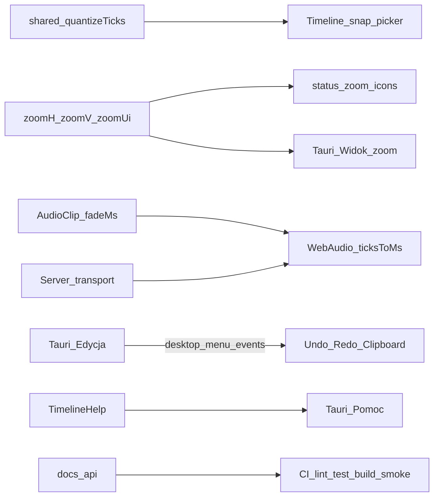

# Scope 5.0.0 — Kompletny parytet v4 (bez stubów) + polish / Faza D

**Wersja docelowa:** `5.0.0` (tag / bump **tylko na prośbę**; nazwa hero linii 5.0 przy cutcie)  
**Podstawa:** [ROADMAP.md](../../ROADMAP.md) · [TODO.md](../../TODO.md) · [ADR 0002](../../adr/0002-timebase-ssot.md) · [ADR 0005](../../adr/0005-domain-axioms.md) · [ADR 0007](../../adr/0007-snap-grid.md) · [ADR 0008](../../adr/0008-timeline-clip-editing.md) · [ADR 0010](../../adr/0010-desktop-shell-tauri.md) · [ADR 0011](../../adr/0011-ui-parity-behavior.md) · [report-beta-gate.md](./report-beta-gate.md) · [report-scope-beta2.md](./report-scope-beta2.md)  
**Bramka wejścia:** `v5.0.0-beta.2` wydane (2026-07-21); P8 green  
**Status kodu (2026-07-22):** must **A–E** + Faza D + mobile + help/i18n — **na `main`**. Tag **nie** wycięty. **G1–G10** = ⬜ operator HW.

## Cel

Domknąć **stabilne 5.0.0** jako **kompletny** produkt operatorski względem v4
([ADR 0011 §1a](../../adr/0011-ui-parity-behavior.md)):

1. **Polish UI** na żywych kontrolkach — bez clone chrome v4.
2. **Timeline** zoom/help/snap + residual parity (wand, tool menu, metrum/CD/grid, MIDI overlay).
3. **Audio** fade/loop (dostarczone) + brak stubów DAW v4 (Mute/Solo już są).
4. **Client Score/OSMD** pełny — **usuń stub**; Live Desk AD-01…03; pitch w Karaoke.
5. **MIDI** Panic/CC jeśli w v4; host nadal SSOT (nie Tauri).
6. **Desktop OS menu — Faza D** residual.
7. **Cues Sampler / Safety Net** — jeśli w legacy → 5.0 (ADR + kod), nie 5.1.
8. **`docs/api` + CI + smoke**; **G1–G10** HW; tag bez stubów v4.

## Kontrakt IN / OUT

| IN 5.0.0 | OUT 5.0.0 |
|----------|-----------|
| Pełny parytet **zachowania v4** (bez stubów) | Stub / „poza 5.0” / atrapa inventarza |
| Polish UI; zoom/help/snap; audio fade/loop | Clone chrome ([ADR 0011](../../adr/0011-ui-parity-behavior.md)) |
| Score/OSMD sync; Live Desk AD-01…03; wand UI; Panic | Flex Time / stretch / pencil audio ([ADR 0008](../../adr/0008-timeline-clip-editing.md)) |
| Menu OS Faza D residual; migrator bez milczącej utraty krytycznych metadanych | MIDI w procesie Tauri ([ADR 0010](../../adr/0010-desktop-shell-tauri.md)) |
| Sampler / Safety Net **jeśli były w v4** | git-apply (nigdy) ([ADR 0004](../../adr/0004-updates-docker.md)) |
| Soft-gate G1–G10 (HW = operator) | Motywy systemowe / auth multi-user / Android (**nowości** → 5.1+) |
| Tag `5.0.0` + nazwa hero | Tag przy otwartych stubach funkcji v4 |

## IN (must) — A: Polish UI — **done (kod)**

Źródło: [TODO](../../TODO.md) · [ui-density](../../../.cursor/rules/ui-density.mdc) · [ADR 0011](../../adr/0011-ui-parity-behavior.md).

| # | Wycinek | Status |
|---|---------|--------|
| A1 | Audyt żywych kontrolek Timeline / Admin / Client | ✓ trains + residual |
| A2 | Typografia / spacing wyłącznie `--ss-*` | ✓ |
| A3 | Copy PL + proporcje / gęstość | ✓ (+ help/i18n [#468](https://github.com/Negatywistyczny/stagesync/pull/468)) |
| A4 | Bez nowych wariantów `Button` | ✓ |

**Powierzchnie (orientacja):** `TimelineShell.tsx` (+ module CSS), Admin (`SetView` / `StageView` / Host), Client shells, `packages/ui` tokeny.

## IN (must) — B: Timeline zoom / Help / snap picker — **done (kod)**

Źródło: [ADR 0007](../../adr/0007-snap-grid.md) faza 2 · `TimelineShell` (stan `zoomH`/`zoomV`/`zoomUi`).

| # | Wycinek | Status |
|---|---------|--------|
| B1 | Zoom H/V (+ UI) z **ikonami** | ✓ |
| B2 | Snap picker UI: `off` / `bar` / `beat` / `subdivision` | ✓ |
| B3 | Pomoc Timeline — pełna treść + skróty sync | ✓ [#468](https://github.com/Negatywistyczny/stagesync/pull/468) |
| B4 | Wiring snap mode → `quantizeTicks` / edycja | ✓ |

## IN (must) — C: Audio polish (fade / crossfade / loop-region) — **done (kod)**

Źródło: [ADR 0008](../../adr/0008-timeline-clip-editing.md) · [#462](https://github.com/Negatywistyczny/stagesync/pull/462).

| # | Wycinek | Status |
|---|---------|--------|
| C1 | Schema: `fadeInMs` / `fadeOutMs` | ✓ |
| C2 | Playback: envelope fade (WebAudio `AudioParam`) | ✓ |
| C3 | UI: Smart fade handles | ✓ |
| C4 | Crossfade przy styku | ✓ (minimal) |
| C5 | Loop-region audio (clip) vs transport cycle | ✓ |
| C6 | Testy shared + smoke playback | ✓ (shared); pełny browser matrix = Should |

## IN (must) — D: Desktop OS menu Faza D — **done (kod)**

Źródło: [ROADMAP](../../ROADMAP.md) · [#460](https://github.com/Negatywistyczny/stagesync/pull/460).

| # | Wycinek | Status |
|---|---------|--------|
| D1 | **Edycja:** Undo / Redo / Delete (+ grey-out stack) | ✓ |
| D2 | **Widok:** Zoom in / out / reset | ✓ |
| D3 | **Pomoc:** Skróty (`help-shortcuts`) | ✓ |
| D4 | Zero MIDI / clock w Rust | ✓ |

## IN (must) — E: docs/api + CI + smoke E2E — **done (kod)**

| # | Wycinek | Status |
|---|---------|--------|
| E1 | Domknięcie `docs/api` | ✓ |
| E2 | CI green `lint-types-test-build` (+ compose / tauri-check) | ✓ na `main` po merge residual |
| E3 | Smoke E2E (health / Forma / transport) | ✓; Playwright Forma drag = Should |

## Soft-gate — G1–G10 (operator; poza oknem HW)

**Brak dostępu do HW w overnight.** Nie zaznaczamy green.

| ID | Status w tym oknie | Akcja overnight |
|----|--------------------|-----------------|
| G1–G10 | ⬜ residual operatorski po β2 | Checklista + sekwencja w [report-beta-gate.md](./report-beta-gate.md); link z TODO; **bez** fałszywego `[x]` |
| G6 kod | prerequisites CI/Release done (darwin+windows `latest.json`) | Bez claim relaunch green |
| Przed tagiem `5.0.0` | Must green na instalatorach β2 (lub artefaktach 5.0.0 RC) | Operator rano |

Zob. sekcja „Sekwencja weryfikacji” w [report-beta-gate.md](./report-beta-gate.md) — baseline `v5.0.0-beta.2`.

## OUT (świadome)

| Temat | Etap |
|-------|------|
| Motywy / auth / multi-user | **5.1+** |
| Android / store auto-update | Poza 5.0.0 |
| MIDI I/O w procesie Tauri | **Nigdy** ([ADR 0010](../../adr/0010-desktop-shell-tauri.md)) |
| Flex Time / pencil audio / stretch poza plik | OUT |
| Clone chrome v4 | **Zakaz** ([ADR 0011](../../adr/0011-ui-parity-behavior.md)) |
| git-apply | Nigdy ([ADR 0004](../../adr/0004-updates-docker.md)) |
| Tag/bump `5.0.0` bez prośby | Zakaz overnight |
| Merge PR → `main` przez agenta overnight | Zakaz overnight (historyczne) — residual closeout PR docs OK |
| Draft OSMD / migration / wand bez green CI | Residual — nie claim w must A–E |

## Should (jeśli czas po must A–E)

| Temat | Uwagi |
|-------|--------|
| Doprecyzowanie ADR 0002 (tempo/metrum pre-roll) | Docs-only jeśli otwarte |
| E2E Forma drag + transport (carry z β1) | Po E3 bazowym |
| Admin panel toggle UX | Drobne |
| AD-01…03 Transpozycja / Lead / Edycja zdalna | Pull-forward tylko jeśli pull |

## Weryfikacja vs ADR / ROADMAP (zero sprzeczności)

| Aksjomat | Status w tym scope |
|----------|-------------------|
| SSOT czasu = serwer; klient wygładza między tickami ([ADR 0002](../../adr/0002-timebase-ssot.md)) | ✓ C2, D4 |
| Kanon = integer ticks + PPQ; ms na krawędzi audio | ✓ C* |
| Snap faza 2 = UI picker; default `bar`; nie w `project.json` ([ADR 0007](../../adr/0007-snap-grid.md)) | ✓ B2, B4 |
| Fade/crossfade/loop-region = 5.0.0; no pencil audio ([ADR 0008](../../adr/0008-timeline-clip-editing.md)) | ✓ C* |
| MIDI / clock nie w Tauri ([ADR 0010](../../adr/0010-desktop-shell-tauri.md)) | ✓ D4, OUT |
| Faza D = 5.0.0 ([ROADMAP](../../ROADMAP.md)) | ✓ D* |
| Parity = zachowanie, nie clone ([ADR 0011](../../adr/0011-ui-parity-behavior.md)) | ✓ A*, B1 |
| G1–G10 = operator HW; CI nie zastępuje | ✓ soft-gate |

## Architektura (domyślna)

## Plan PR (małe; 1 temat = 1 PR; kolejność A→B→C→D→E)

| PR | Branch (propozycja) | Temat | Acceptance (smoke) |
|----|---------------------|-------|-------------------|
| **0** | `docs/scope-5.0.0` → `main` (docs OK) | Ten raport + soft-gate note + link w TODO | Plik w `docs/analysis/reports/`; TODO linkuje |
| **A1** | `feat/ui-polish-live-controls` | Polish UI żywych kontrolek (slice Timeline + transport/status) | Brak regresji layoutu; tokeny `--ss-*`; visual smoke |
| **B1** | `feat/timeline-zoom-icons` | Zoom H/V/UI z ikonami | Suwaki + ikony; skróty zoom działają |
| **B2** | `feat/timeline-snap-picker` | Snap picker ADR 0007 faza 2 | Picker zmienia tryb; pencil/drag używa trybu; Cmd-off OK |
| **B3** | `feat/timeline-help-full` | Pełna treść Pomocy | Overlay pokrywa audio/MIDI/snap/zoom |
| **C1** | `feat/audio-fade-schema-playback` | Schema fade + playback envelope | Vitest shared; play z fadeIn/Out |
| **C2** | `feat/audio-fade-ui-loop` | Fade handles UI + loop-region clip (+ overlap jeśli czas) | Gest Smart; persist draft |
| **D1** | `feat/desktop-menu-phase-d` | Menu Edycja + zoom Widok + Pomoc | Eventy → UI; cargo check |
| **E1** | `docs/api-closeout-5.0.0` | Domknięcie `docs/api` | README zgodny z serwerem |
| **E2** | `test/smoke-e2e-5.0.0` | Smoke E2E / CI hook | Job lub skrypt green w CI |

**Zasady PR:** bez merge przez agenta; push `-u`; CI do green follow-up commitami; nie force-push; nie tagować `5.0.0`.

### Soft-gate docs (PR 0 lub osobny chore)

- Aktualizacja [report-beta-gate.md](./report-beta-gate.md): sekcja „Przed 5.0.0 / soft-gate overnight” — G1–G10 nadal ⬜; lista artefaktów β2; zakaz claim green.
- TODO: odhaczyć „Scope report…” po merge PR 0; G1–G10 zostaje otwarte.

## Kryteria zamknięcia etapu (przy tagu — tylko na prośbę)

1. Must A–E merged + CI green na `main`.
2. G1–G10 green **operator** na HW (lub świadomy waiver w report-beta-gate).
3. Bump `5.0.0` + CHANGELOG + **nazwa hero** linii 5.0 + tag `v5.0.0`.
4. TODO → sekcja `5.1` (procedura w TODO.md).

## Handoff morning (2026-07-22 — overnight; update ~01:36 CEST)

**Agent:** bez merge; bez tagu `5.0.0`; G1–G10 ⬜. Okno do **10:00 UTC+2**.

### Must A–E #53–#60 — green (nie koniec)

### Wave 3–6 PRs (this overnight stretch)

**Transport / MIDI:** [#120](https://github.com/Negatywistyczny/stagesync/pull/120)–[#123](https://github.com/Negatywistyczny/stagesync/pull/123), [#127](https://github.com/Negatywistyczny/stagesync/pull/127), [#140](https://github.com/Negatywistyczny/stagesync/pull/140), [#150](https://github.com/Negatywistyczny/stagesync/pull/150)–[#151](https://github.com/Negatywistyczny/stagesync/pull/151), [#154](https://github.com/Negatywistyczny/stagesync/pull/154)

**Forma / audio / metro:** [#124](https://github.com/Negatywistyczny/stagesync/pull/124)–[#125](https://github.com/Negatywistyczny/stagesync/pull/125), [#142](https://github.com/Negatywistyczny/stagesync/pull/142), [#144](https://github.com/Negatywistyczny/stagesync/pull/144)

**Admin / Client / desktop:** [#128](https://github.com/Negatywistyczny/stagesync/pull/128)–[#139](https://github.com/Negatywistyczny/stagesync/pull/139), [#141](https://github.com/Negatywistyczny/stagesync/pull/141), [#143](https://github.com/Negatywistyczny/stagesync/pull/143), [#145](https://github.com/Negatywistyczny/stagesync/pull/145)–[#146](https://github.com/Negatywistyczny/stagesync/pull/146), [#148](https://github.com/Negatywistyczny/stagesync/pull/148)–[#149](https://github.com/Negatywistyczny/stagesync/pull/149), [#152](https://github.com/Negatywistyczny/stagesync/pull/152)–[#153](https://github.com/Negatywistyczny/stagesync/pull/153)

**Docs handoff:** [#126](https://github.com/Negatywistyczny/stagesync/pull/126), [#138](https://github.com/Negatywistyczny/stagesync/pull/138), [#147](https://github.com/Negatywistyczny/stagesync/pull/147), this PR

### Merge hotspots

- engine.ts: #123 + #140 + #150
- app.ts MIDI: #122 + #127
- Forma commitMoveClip: #124 → #125
- ClientShell: #120 + #143 + #146 + #148 + #152 + #153
- #73 + #121 (+ #151 end ticks)
- #98 before #100/#148/#149

### Remaining

1. Tempo-map-aware `ticksToMs` for audio offsets (deeper than #144)
2. Playwright Forma — defer
3. G1–G10 HW — operator
4. Tag 5.0.0 — only on request

### Blokery

G1–G10 soft-gate; #83 lifecycle token; TimelineShell rebases.

---

## Final handoff — merge trains 0–8 (2026-07-22)

**Status:** wszystkie squash PR-y zmergowane na `main`. **Merge SHA train 8:** `81a86a17e9982dad09a1e9ced91b9fa307fd94cb`.  
**Źródłowe PR-y zamknięte:** 266 (komentarz `merged via train-8 PR #416`).  
**Otwarte świadomie:** [#61](https://github.com/Negatywistyczny/stagesync/pull/61) (ruler split), [#63](https://github.com/Negatywistyczny/stagesync/pull/63) (visual help overlay).  
**G1–G10:** ⬜ — operator HW; **bez claim green** w docs/CI.

| Train | Squash PR | Temat (skrót) |
|-------|-----------|----------------|
| 0 | [#408](https://github.com/Negatywistyczny/stagesync/pull/408) | Must 5.0.0: fade schema/UI, TimelineHelp, audio crossfade |
| 1 | [#409](https://github.com/Negatywistyczny/stagesync/pull/409) | Should: smoke E2E, docs/api, forma cascade |
| 2 | [#410](https://github.com/Negatywistyczny/stagesync/pull/410) | Shared: timebase, meter map, clip collision |
| 3 | [#411](https://github.com/Negatywistyczny/stagesync/pull/411) | Shared: schema hardening wave 1 |
| 4 | [#412](https://github.com/Negatywistyczny/stagesync/pull/412) | Server: routes, WS, transport engine |
| 5 | [#413](https://github.com/Negatywistyczny/stagesync/pull/413) | Web: Timeline/admin polish, zoom, snap |
| 6 | [#414](https://github.com/Negatywistyczny/stagesync/pull/414) | Web/admin + desktop menu wave |
| 7 | [#415](https://github.com/Negatywistyczny/stagesync/pull/415) | MIDI + desktop transport surfacing |
| 8 | [#416](https://github.com/Negatywistyczny/stagesync/pull/416) | Residual hardening + UI token hygiene |

**Weryfikacja po merge:** `pnpm lint && pnpm check-types && pnpm test && pnpm build` green lokalnie i w CI (#416).  
**Następne kroki:** PO smoke na `main`; operator G1–G10; tag `v5.0.0` + nazwa hero **tylko na prośbę**.

---

## Closeout residual (2026-07-22) — docs + kod must

**Kod zmergowany po trains (kolejność):** [#462](https://github.com/Negatywistyczny/stagesync/pull/462) audio fade/loop → [#460](https://github.com/Negatywistyczny/stagesync/pull/460) Faza D → [#468](https://github.com/Negatywistyczny/stagesync/pull/468) help/skróty + i18n → [#464](https://github.com/Negatywistyczny/stagesync/pull/464) mobile.  
**Zamknięty bez merge:** [#463](https://github.com/Negatywistyczny/stagesync/pull/463) (superseded by #468).

| Must | Status |
|------|--------|
| A–E | ✓ w kodzie na `main` |
| Faza D | ✓ #460 |
| Mobile breakpoints | ✓ #464 |
| G1–G10 | ⬜ **operator HW — bez claim green** |
| Tag / bump `5.0.0` | ⛔ tylko na prośbę |

| Draft residual | Status |
|----------------|--------|
| [#465](https://github.com/Negatywistyczny/stagesync/pull/465) OSMD score nav | OPEN draft, **CI red** — nie merge |
| [#466](https://github.com/Negatywistyczny/stagesync/pull/466) migration assets meta | OPEN draft, **CI red** — nie merge |
| [#467](https://github.com/Negatywistyczny/stagesync/pull/467) wand karaoke MIDI | OPEN draft, CI green — zostaje draft do stabilizacji TimelineShell |

**Świadome OUT / 5.1+:** Safety Net [#437](https://github.com/Negatywistyczny/stagesync/issues/437), Cues Sampler [#430](https://github.com/Negatywistyczny/stagesync/issues/430), motywy/auth — bez kodu w 5.0.0.