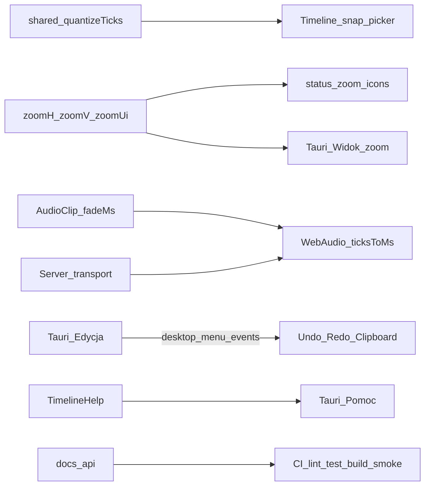

# Scope 5.0.0 — Stabilne wydanie + polish UI / Timeline / audio / Faza D

**Wersja docelowa:** `5.0.0` (tag / bump **tylko na prośbę**; nazwa hero linii 5.0 przy cutcie)  
**Podstawa:** [ROADMAP.md](../../ROADMAP.md) · [TODO.md](../../TODO.md) · [ADR 0002](../../adr/0002-timebase-ssot.md) · [ADR 0005](../../adr/0005-domain-axioms.md) · [ADR 0007](../../adr/0007-snap-grid.md) · [ADR 0008](../../adr/0008-timeline-clip-editing.md) · [ADR 0010](../../adr/0010-desktop-shell-tauri.md) · [ADR 0011](../../adr/0011-ui-parity-behavior.md) · [report-beta-gate.md](./report-beta-gate.md) · [report-scope-beta2.md](./report-scope-beta2.md)  
**Bramka wejścia:** `v5.0.0-beta.2` wydane (2026-07-21); P8 green; start kodu na jawną prośbę (overnight audit 2026-07-21→22)  
**Okno implementacji:** do **10:00** (UTC+2) 2026-07-22 — małe PR-y, **bez merge do `main`**, CI green; G1–G10 = soft-gate (bez HW)

## Cel

Domknąć **stabilne 5.0.0** jako linię produktową (nie kolejny beta feature dump):

1. **Polish UI** na żywych kontrolkach (typografia `--ss-*`, proporcje, copy PL, gęstość) — bez clone chrome v4 ([ADR 0011](../../adr/0011-ui-parity-behavior.md)).
2. **Timeline P1:** zoom H/V z ikonami; Pomoc z pełną treścią; **snap picker** beat/subdivision ([ADR 0007](../../adr/0007-snap-grid.md) faza 2).
3. **Audio polish:** fade, crossfade, loop-region (ewent. overlap) ([ADR 0008](../../adr/0008-timeline-clip-editing.md)).
4. **Desktop OS menu — Faza D:** pełna Edycja; zoom w Widok; rozbudowa Pomoc ([ROADMAP](../../ROADMAP.md)).
5. **`docs/api` domknięte** + CI + smoke E2E (automatyzowalne).
6. **G1–G10:** checklista soft-gate dla operatora rano — **nie** claim green bez HW.

## Kontrakt IN / OUT

| IN 5.0.0 | OUT 5.0.0 |
|----------|-----------|
| Polish UI żywych kontrolek (A) | Motywy / auth / multi-user → **5.1+** |
| Zoom UI H/V + ikony; Help pełny; snap picker (B) | Clone chrome / inventarz-first ([ADR 0011](../../adr/0011-ui-parity-behavior.md)) |
| Fade / crossfade / loop-region; ewent. overlap (C) | Flex Time / stretch / pencil audio / MIDI w Tauri |
| Menu OS Faza D (D) | Android shell / store auto-update |
| `docs/api` + CI + smoke E2E (E) | git-apply (nigdy) |
| Soft-gate G1–G10 (docs checklist; HW = operator) | Fałszywy green G1–G10 w CI |
| Tag `5.0.0` + nazwa hero | Tag/bump **bez** prośby użytkownika |

## IN (must) — A: Polish UI

Źródło: [TODO](../../TODO.md) · [ui-density](../../../.cursor/rules/ui-density.mdc) · [ADR 0011](../../adr/0011-ui-parity-behavior.md).

| # | Wycinek | Uwagi |
|---|---------|--------|
| A1 | Audyt żywych kontrolek Timeline / Admin / Client | Transport, status zoom, dock, inspector, Admin Live Desk |
| A2 | Typografia / spacing wyłącznie `--ss-*` | Brak ad-hoc `font-size` px / HEX w shellach |
| A3 | Copy PL + proporcje / gęstość | Parity = zachowanie, nie ikony |
| A4 | Bez nowych wariantów `Button` | Zamknięty zbiór 7 stanów |

**Powierzchnie (orientacja):** `TimelineShell.tsx` (+ module CSS), Admin (`SetView` / `StageView` / Host), Client shells, `packages/ui` tokeny.

## IN (must) — B: Timeline zoom / Help / snap picker

Źródło: [ADR 0007](../../adr/0007-snap-grid.md) faza 2 · ROADMAP § Alpha 4 odłożone · `TimelineShell` (stan `zoomH`/`zoomV`/`zoomUi` już istnieje — suwaki tekstowe H/V/UI).

| # | Wycinek | Uwagi |
|---|---------|--------|
| B1 | Zoom H/V (+ UI) z **ikonami** przy suwakach / +/- | Reuse `apps/web/src/shells/icons.tsx`; bez narzędzia lupy (OUT α8) |
| B2 | Snap picker UI: `off` / `bar` / `beat` / `subdivision` | Sesja Timeline (+ opcjonalnie localStorage); default `bar`; Cmd/Ctrl = chwilowy off (już α7) |
| B3 | Pomoc Timeline — pełna treść | Rozszerzyć `TimelineHelp.tsx` (audio β2, MIDI host, snap picker, Faza D skróty); bez emoji chrome |
| B4 | Wiring snap mode → `quantizeTicks` / edycja | Stan React; nie zapis w `project.json` (ADR 0007) |

## IN (must) — C: Audio polish (fade / crossfade / loop-region)

Źródło: [ADR 0008](../../adr/0008-timeline-clip-editing.md) §1, §4, §6, §9 · schema `AudioClipSchema` (dziś: trim/gain/mute, **bez** fade).

| # | Wycinek | Uwagi |
|---|---------|--------|
| C1 | Schema: `fadeInMs` / `fadeOutMs` (ew. crossfade pair) | Zod na krawędzi; fail-fast; bump formatu wg ADR 0009 jeśli potrzeba |
| C2 | Playback: envelope fade przy WebAudio scheduler | Pozycja z ticków serwera (`ticksToMs`); bez zegara muzycznego klienta |
| C3 | UI: Smart zones górne narożniki = fade handles | Pointer/Smart; bez pencil audio |
| C4 | Crossfade przy styku / overlap mode (opcjonalnie) | Jeśli czas: minimalny overlap + X-fade; inaczej defer z notatką w handoff |
| C5 | Loop-region audio (clip loop) vs transport cycle | Rozróżnić: transport loop (już jest) vs **loop-region klipu**; must = clip loop-region per ADR |
| C6 | Testy shared + smoke playback | Czyste funkcje; bez `Date.now()` w konwersji domenowej |

## IN (must) — D: Desktop OS menu Faza D

Źródło: [ROADMAP](../../ROADMAP.md) § Desktop OS menu · `apps/desktop/src-tauri/src/lib.rs` (A+B+C done; **brak** submenu Edycja; Widok bez zoom; Pomoc = docs/issues).

| # | Wycinek | Uwagi |
|---|---------|--------|
| D1 | **Edycja:** Undo / Redo / Cut / Copy / Paste / Delete | Mostek `stagesync:desktop-menu` → istniejące commandy Timeline; **bez** disabled „na zapas”; gdy brak stacka — disable tylko realnie |
| D2 | **Widok:** Zoom in / out / reset (H lub UI) | Event → handlery zoom w Timeline (już `zoomHorizontalBySteps` / UI) |
| D3 | **Pomoc:** skróty / overlay pomocy / rozbudowa | Otwórz Timeline Help; ewentualnie PDF setlisty / archiwum jeśli API gotowe — inaczej OUT z checklistą |
| D4 | Zero MIDI / clock w Rust | Shell tylko mostkuje; SSOT = `apps/server` |

## IN (must) — E: docs/api + CI + smoke E2E

Źródło: [docs/api/README.md](../../api/README.md) (nieaktualne: v2, brak MIDI / setlist / assets / desktop paths).

| # | Wycinek | Uwagi |
|---|---------|--------|
| E1 | Domknięcie `docs/api` do stanu β2+ | REST + WS: projects v3+, transport Countdown, MIDI, setlist, assets, OCC `details` |
| E2 | CI: utrzymać green `lint-types-test-build` (+ compose / tauri-check) | Fix regresji w PR-ach A–D |
| E3 | Smoke E2E (automatyzowalne) | Minimalny smoke: health + transport play/stop **lub** Playwright Forma drag jeśli infra gotowa; nie blokować tagu brakiem pełnego browser matrix |

## Soft-gate — G1–G10 (operator; poza oknem HW)

**Brak dostępu do HW w overnight.** Nie zaznaczamy green.

| ID | Status w tym oknie | Akcja overnight |
|----|--------------------|-----------------|
| G1–G10 | ⬜ residual operatorski po β2 | Checklista + sekwencja w [report-beta-gate.md](./report-beta-gate.md); link z TODO; **bez** fałszywego `[x]` |
| G6 kod | prerequisites CI/Release done (darwin+windows `latest.json`) | Bez claim relaunch green |
| Przed tagiem `5.0.0` | Must green na instalatorach β2 (lub artefaktach 5.0.0 RC) | Operator rano |

Zob. sekcja „Sekwencja weryfikacji” w [report-beta-gate.md](./report-beta-gate.md) — baseline `v5.0.0-beta.2`.

## OUT (świadome)

| Temat | Etap |
|-------|------|
| Motywy / auth / multi-user | **5.1+** |
| Android / store auto-update | Poza 5.0.0 |
| MIDI I/O w procesie Tauri | **Nigdy** ([ADR 0010](../../adr/0010-desktop-shell-tauri.md)) |
| Flex Time / pencil audio / stretch poza plik | OUT |
| Clone chrome v4 | **Zakaz** ([ADR 0011](../../adr/0011-ui-parity-behavior.md)) |
| git-apply | Nigdy ([ADR 0004](../../adr/0004-updates-docker.md)) |
| Tag/bump `5.0.0` bez prośby | Zakaz overnight |
| Merge PR → `main` przez agenta | Zakaz — user rano |

## Should (jeśli czas po must A–E)

| Temat | Uwagi |
|-------|--------|
| Doprecyzowanie ADR 0002 (tempo/metrum pre-roll) | Docs-only jeśli otwarte |
| E2E Forma drag + transport (carry z β1) | Po E3 bazowym |
| Admin panel toggle UX | Drobne |
| AD-01…03 Transpozycja / Lead / Edycja zdalna | Pull-forward tylko jeśli pull |

## Weryfikacja vs ADR / ROADMAP (zero sprzeczności)

| Aksjomat | Status w tym scope |
|----------|-------------------|
| SSOT czasu = serwer; klient wygładza między tickami ([ADR 0002](../../adr/0002-timebase-ssot.md)) | ✓ C2, D4 |
| Kanon = integer ticks + PPQ; ms na krawędzi audio | ✓ C* |
| Snap faza 2 = UI picker; default `bar`; nie w `project.json` ([ADR 0007](../../adr/0007-snap-grid.md)) | ✓ B2, B4 |
| Fade/crossfade/loop-region = 5.0.0; no pencil audio ([ADR 0008](../../adr/0008-timeline-clip-editing.md)) | ✓ C* |
| MIDI / clock nie w Tauri ([ADR 0010](../../adr/0010-desktop-shell-tauri.md)) | ✓ D4, OUT |
| Faza D = 5.0.0 ([ROADMAP](../../ROADMAP.md)) | ✓ D* |
| Parity = zachowanie, nie clone ([ADR 0011](../../adr/0011-ui-parity-behavior.md)) | ✓ A*, B1 |
| G1–G10 = operator HW; CI nie zastępuje | ✓ soft-gate |

## Architektura (domyślna)

## Plan PR (małe; 1 temat = 1 PR; kolejność A→B→C→D→E)

| PR | Branch (propozycja) | Temat | Acceptance (smoke) |
|----|---------------------|-------|-------------------|
| **0** | `docs/scope-5.0.0` → `main` (docs OK) | Ten raport + soft-gate note + link w TODO | Plik w `docs/analysis/reports/`; TODO linkuje |
| **A1** | `feat/ui-polish-live-controls` | Polish UI żywych kontrolek (slice Timeline + transport/status) | Brak regresji layoutu; tokeny `--ss-*`; visual smoke |
| **B1** | `feat/timeline-zoom-icons` | Zoom H/V/UI z ikonami | Suwaki + ikony; skróty zoom działają |
| **B2** | `feat/timeline-snap-picker` | Snap picker ADR 0007 faza 2 | Picker zmienia tryb; pencil/drag używa trybu; Cmd-off OK |
| **B3** | `feat/timeline-help-full` | Pełna treść Pomocy | Overlay pokrywa audio/MIDI/snap/zoom |
| **C1** | `feat/audio-fade-schema-playback` | Schema fade + playback envelope | Vitest shared; play z fadeIn/Out |
| **C2** | `feat/audio-fade-ui-loop` | Fade handles UI + loop-region clip (+ overlap jeśli czas) | Gest Smart; persist draft |
| **D1** | `feat/desktop-menu-phase-d` | Menu Edycja + zoom Widok + Pomoc | Eventy → UI; cargo check |
| **E1** | `docs/api-closeout-5.0.0` | Domknięcie `docs/api` | README zgodny z serwerem |
| **E2** | `test/smoke-e2e-5.0.0` | Smoke E2E / CI hook | Job lub skrypt green w CI |

**Zasady PR:** bez merge przez agenta; push `-u`; CI do green follow-up commitami; nie force-push; nie tagować `5.0.0`.

### Soft-gate docs (PR 0 lub osobny chore)

- Aktualizacja [report-beta-gate.md](./report-beta-gate.md): sekcja „Przed 5.0.0 / soft-gate overnight” — G1–G10 nadal ⬜; lista artefaktów β2; zakaz claim green.
- TODO: odhaczyć „Scope report…” po merge PR 0; G1–G10 zostaje otwarte.

## Kryteria zamknięcia etapu (przy tagu — tylko na prośbę)

1. Must A–E merged + CI green na `main`.
2. G1–G10 green **operator** na HW (lub świadomy waiver w report-beta-gate).
3. Bump `5.0.0` + CHANGELOG + **nazwa hero** linii 5.0 + tag `v5.0.0`.
4. TODO → sekcja `5.1` (procedura w TODO.md).

## Handoff morning (2026-07-22 — overnight; update ~00:05 CEST interim)

**Agent:** bez merge do `main`; bez tagu `5.0.0`; G1–G10 **nie** green. Okno do **10:00 UTC+2**.

### Must A–E (#53–#60)

| # | Temat | URL | CI (ostatnio) |
|---|--------|-----|----------------|
| — | Scope + soft-gate | `main` | — |
| [#53](https://github.com/Negatywistyczny/stagesync/pull/53) | A1 polish live controls | https://github.com/Negatywistyczny/stagesync/pull/53 | green |
| [#54](https://github.com/Negatywistyczny/stagesync/pull/54) | B1 zoom icons (stack #53) | https://github.com/Negatywistyczny/stagesync/pull/54 | green |
| [#55](https://github.com/Negatywistyczny/stagesync/pull/55) | B2 snap picker | https://github.com/Negatywistyczny/stagesync/pull/55 | green |
| [#56](https://github.com/Negatywistyczny/stagesync/pull/56) | B3 help full | https://github.com/Negatywistyczny/stagesync/pull/56 | green |
| [#57](https://github.com/Negatywistyczny/stagesync/pull/57) | C1 fade schema+playback | https://github.com/Negatywistyczny/stagesync/pull/57 | green |
| [#58](https://github.com/Negatywistyczny/stagesync/pull/58) | C2 fade/loop inspector (stack #57) | https://github.com/Negatywistyczny/stagesync/pull/58 | green |
| [#59](https://github.com/Negatywistyczny/stagesync/pull/59) | D menu Faza D | https://github.com/Negatywistyczny/stagesync/pull/59 | green |
| [#60](https://github.com/Negatywistyczny/stagesync/pull/60) | E docs/api + smoke e2e | https://github.com/Negatywistyczny/stagesync/pull/60 | green |

**Merge order:** #53→#54; #57→#58. Rebase TimelineShell conflicts rano jeśli trzeba.

### Wave 2+ (po must; otwarte)

| # | Temat | URL | CI |
|---|--------|-----|-----|
| [#64](https://github.com/Negatywistyczny/stagesync/pull/64) | Smart fade handles | https://github.com/Negatywistyczny/stagesync/pull/64 | green (lint fix) |
| [#65](https://github.com/Negatywistyczny/stagesync/pull/65) | ADR 0002 pre-roll tempo/meter | https://github.com/Negatywistyczny/stagesync/pull/65 | green |
| [#66](https://github.com/Negatywistyczny/stagesync/pull/66) | Abut crossfade helper + inspector | https://github.com/Negatywistyczny/stagesync/pull/66 | green |
| [#67](https://github.com/Negatywistyczny/stagesync/pull/67) | Smoke Forma put+seek+transport | https://github.com/Negatywistyczny/stagesync/pull/67 | green |
| [#68](https://github.com/Negatywistyczny/stagesync/pull/68) | Touch targets 36/44 tokens | https://github.com/Negatywistyczny/stagesync/pull/68 | green |
| [#69](https://github.com/Negatywistyczny/stagesync/pull/69) | Wire `[`/`]` setlist keys + Help | https://github.com/Negatywistyczny/stagesync/pull/69 | pending |
| [#70](https://github.com/Negatywistyczny/stagesync/pull/70) | Soft-clock loop wrap | https://github.com/Negatywistyczny/stagesync/pull/70 | pending |
| [#71](https://github.com/Negatywistyczny/stagesync/pull/71) | Lock `getLibrary` cold seed | https://github.com/Negatywistyczny/stagesync/pull/71 | pending |
| [#72](https://github.com/Negatywistyczny/stagesync/pull/72) | OCC 409 PL save message | https://github.com/Negatywistyczny/stagesync/pull/72 | pending |
| [#73](https://github.com/Negatywistyczny/stagesync/pull/73) | Setlist auto-advance @ song end | https://github.com/Negatywistyczny/stagesync/pull/73 | pending |
| [#74](https://github.com/Negatywistyczny/stagesync/pull/74) | Admin Partytura + backup honesty | https://github.com/Negatywistyczny/stagesync/pull/74 | pending |
| [#75](https://github.com/Negatywistyczny/stagesync/pull/75) | Forma scissors lane hit | https://github.com/Negatywistyczny/stagesync/pull/75 | pending |

### Parallel (other agents)

| # | Temat | Note |
|---|--------|------|
| [#50](https://github.com/Negatywistyczny/stagesync/pull/50)–[#52](https://github.com/Negatywistyczny/stagesync/pull/52) | fullscreen / docs | green |
| [#61](https://github.com/Negatywistyczny/stagesync/pull/61) | ruler loop/playhead lanes | green |
| [#62](https://github.com/Negatywistyczny/stagesync/pull/62) | Cmd/Ctrl+C Edit menu | green |
| [#63](https://github.com/Negatywistyczny/stagesync/pull/63) | visual Timeline help | green CI; **ADR 0011** — status-token lane chips (comment left) |

### Remaining backlog (ranked)

1. ClientShell token hygiene (ad-hoc font-weight / clamp / pill radii)
2. Admin songs↔inspector collapse / density deep-pass
3. Playwright Forma drag matrix — defer
4. Overlap drag / Flex Time — OUT
5. AD-01…03 — skip unless tiny
6. PDF setlist / project archive — no API; OUT menu D extras

### Blokery

- G1–G10: soft-gate only — **nie** claim green bez HW ([report-beta-gate.md](./report-beta-gate.md)).
- #63 review: prefer primary/muted for help lane previews (nie tęcza status).
- Stacks: #64/#66 assume fade PRs; merge C stack before handles/crossfade.

## Wave 2 backlog (historical ranking at start of cont.)

| Rank | Temat | Outcome |
|------|--------|---------|
| 1 | Smart fade handles | → [#64](https://github.com/Negatywistyczny/stagesync/pull/64) |
| 2 | Crossfade at abut | → [#66](https://github.com/Negatywistyczny/stagesync/pull/66) |
| 3 | ADR 0002 pre-roll | → [#65](https://github.com/Negatywistyczny/stagesync/pull/65) |
| 4 | Smoke Forma + transport | → [#67](https://github.com/Negatywistyczny/stagesync/pull/67) |
| 5 | Admin density | partial → [#74](https://github.com/Negatywistyczny/stagesync/pull/74); deep-pass still open |
| 6 | Client token hygiene | still open |
| 7 | AD-01…03 | skipped |
