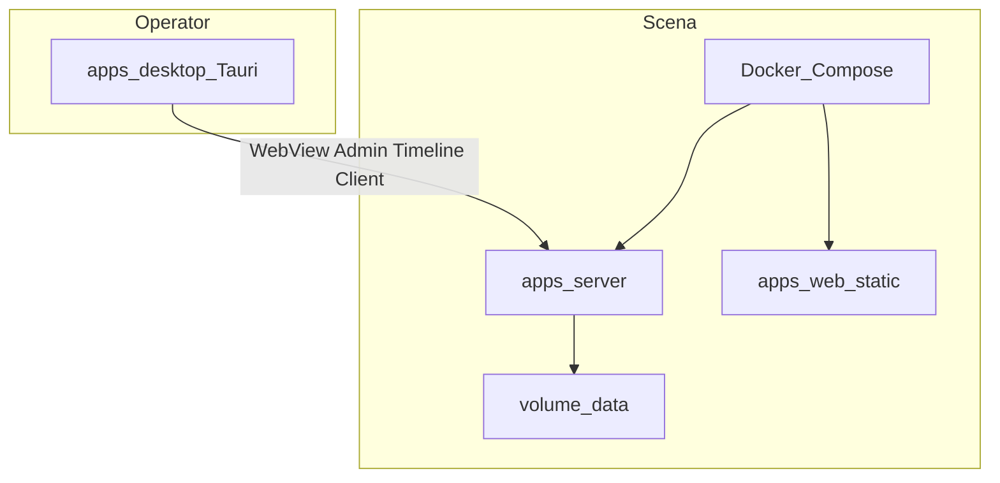

# Scope beta.1 — Host / dystrybucja

**Wersja docelowa:** `5.0.0-beta.1` (tag / bump **tylko na prośbę**)  
**Podstawa:** [ROADMAP.md](../../ROADMAP.md) · [TODO.md](../../TODO.md) · [ADR 0004](../../adr/0004-updates-docker.md) · [ADR 0010](../../adr/0010-desktop-shell-tauri.md) · [ADR 0002](../../adr/0002-timebase-ssot.md)  
**Bramka wejścia:** α9 wydane + P8 green ([report-po-smoke-p8.md](./report-po-smoke-p8.md))

## Cel

Dostarczyć **host i dystrybucję** na scenę / laptop operatora:

1. **Docker Compose** — immutable obraz + volume `data/` (update = bump tagu).
2. **Tauri** — thin WebView (Win + mac) → lokalny serwer (preferencja URL do Compose / `:4000`).
3. **Stabilność volume** — OCC `409`, shadow backup, migracja schematu przy starcie.

**Bez** nowych funkcji produktowych (audio, MIDI, Live Desk, wand, Timeline Help feature, P1 Timeline).

## Kontrakt IN / OUT

| IN β1 | OUT β1 (najwcześniej β2 / 5.0.0) |
|-------|----------------------------------|
| Docker Compose + volume `data/` | Audio playback / clip / gain / mute |
| Tauri thin WebView (Win + mac) | Host MIDI I/O |
| Stabilność hosta (backup, OCC, migracje volume) | AD-01…03 Live Desk |
| CI / docs instalacji | Wand, Timeline Help **feature**, P1 Timeline gaps |
| ESLint ACL shared + Zod `details` | git-apply / „Zaktualizuj teraz” (nigdy) |
| | Android / store auto-update |

Feature **Should** z wcześniejszego szkicu TODO (Help, wand, P1) → **β2 / 5.0.0 OUT**, nie must-path β1.

## IN (must)

| # | Wycinek | Uwagi |
|---|---------|--------|
| H1 | Scope report (ten plik) + TODO/ROADMAP hygiene | Faza 0 |
| H2 | `Dockerfile` + `compose.yml`; volume `./data` → `/app/data` | [ADR 0004](../../adr/0004-updates-docker.md); [INSTALL.md](../../INSTALL.md) |
| H3 | Serwer serwuje static `apps/web` w obrazie (`STAGESYNC_STATIC_DIR`) | Jeden proces HTTP/WS |
| H4 | OCC: `PUT /api/projects/:id` z `updatedAt` klienta → mismatch **409** | Fail-fast; bez last-write-wins |
| H5 | Shadow backup przed destrukcyjnym overwrite / migracją na volume | `.bak` / timestamped |
| H6 | Migracja schematu library/projects **przy starcie** (write-back v5) | Zod fail-fast; bez cichej naprawy |
| H7 | ESLint ACL: web ↛ server; shared ↛ DOM / Node FS | `no-restricted-imports` |
| H8 | API błędy Zod: `{ ok: false, error, details? }` | Shared `ApiErrorSchema` |
| H9 | `apps/desktop` Tauri thin shell → `http://127.0.0.1:<port>` | [ADR 0010](../../adr/0010-desktop-shell-tauri.md); **bez** sidecar Node w β1 (prefer URL) |
| H10 | CI: Compose build + Tauri smoke (mac lub docs manual Win) | Release tag tylko na prośbę |

## IN (should — host only)

| # | Wycinek | Uwagi |
|---|---------|--------|
| S1 | Doprecyzowanie ADR 0002 (tempo/metrum pre-roll) — jeśli nadal otwarte | Nie bloker Compose/Tauri |
| S2 | E2E smoke Forma + transport (carry) | Nie bloker obrazu |

## OUT (świadome)

| Temat | Etap |
|-------|------|
| Audio playback / clip edit / gain / mute | β2 |
| Host MIDI I/O | β2 |
| AD-01…03 Live Desk | β2 |
| Timeline Help (overlay + skróty) jako feature | β2 / 5.0.0 |
| Różdżka (wand) przywrócenie | β2 / 5.0.0 |
| P1 Timeline gaps (np. TE-13) | β2 / 5.0.0 |
| Sidecar Node w bundlu desktop | OUT β1 — WebView → lokalny Compose/`pnpm` server |
| git-apply / „Zaktualizuj teraz” | Nigdy ([ADR 0004](../../adr/0004-updates-docker.md)) |
| Android / store auto-update | Poza β1 |
| Clone chrome v4 | Zakaz ([ADR 0011](../../adr/0011-ui-parity-behavior.md)) |

## Architektura (domyślna)

- **Compose** = kanoniczny host na scenie: immutable image; update = bump tagu; `data/` na volume.
- **Tauri** = thin shell ładuje ten sam web UI z URL lokalnego serwera; **bez** zegara muzycznego w procesie shella.
- Sidecar Node w bundlu — **nie** w scope β1 (scope report: prefer URL).

## Admin UI (kontrakt ADR 0004 — amendement β1)

- Pokazuje wersję oprogramowania.
- **Sprawdź aktualizacje** na żądanie → porównanie semver (GitHub Releases); **Aktualizuj host** (Watchtower HTTP) z confirmem.
- W Tauri: dodatkowy wiersz **Aktualizuj aplikację** (plugin-updater + minisign).
- **git-apply / auto-update w tle** — nadal OUT.

## Release

1. Must H1–H10 green w CI / docs.
2. Bump root `package.json` → `5.0.0-beta.1` + CHANGELOG + tag — **tylko na prośbę**.
3. TODO → sekcja β2 **na prośbę** po zamknięciu β1.
