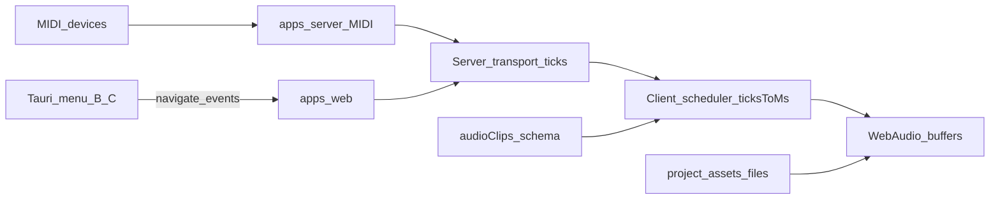

# Scope beta.2 — Audio 0…N + MIDI serwera + menu B/C + G1–G10

**Wersja docelowa:** `5.0.0-beta.2` (tag / bump **tylko na prośbę**)  
**Docs cut residual:** `5.0.0-beta.1.1` (2026-07-21) — menu B + G1–G10 = must, nie soft carry  
**Podstawa:** [ROADMAP.md](../../ROADMAP.md) · [TODO.md](../../TODO.md) · [ADR 0002](../../adr/0002-timebase-ssot.md) · [ADR 0008](../../adr/0008-timeline-clip-editing.md) · [ADR 0010](../../adr/0010-desktop-shell-tauri.md) · [report-beta-gate.md](./report-beta-gate.md)  
**Bramka wejścia:** β1 / β1.1 wydane; P8 green

## Cel

Dostarczyć **sceniczny playback i host MIDI** oraz domknąć **menu operatora (Faza B+C)** i **ręczną bramkę G1–G10** na instalatorach przed tagiem β2:

1. **Audio 0…N** — clipy na Timeline, sync do ticków serwera (`ticksToMs`), trim/move, waveform, gain/mute (ADR 0008).
2. **MIDI I/O + clock** — wyłącznie w `apps/server` (ADR 0010 / ADR 0002).
3. **Menu OS Faza B + C** — Plik/Host + Transport → istniejące API / navigate (bez autorytetu czasu w Tauri).
4. **G1–G10** green (krytyczne) na artefaktach przed tagiem.

## Kontrakt IN / OUT

| IN β2 | OUT β2 |
|-------|--------|
| Audio playback + clip edit (trim/move, no-overlap) | Fade / crossfade / loop-region → **5.0.0** |
| Waveform peak/RMS; gain clip; fader/mute track | Flex Time / stretch poza plik / pencil na audio |
| MIDI device I/O + clock w **serwera** | MIDI w procesie **Tauri** (zakaz) |
| Menu OS Faza B (Plik + Host) | Menu OS Faza D → **5.0.0** |
| Menu OS Faza C (Transport) | Android / store auto-update |
| G1–G10 weryfikacja przed tagiem | git-apply (nigdy) |

## IN (must) — Audio (A)

Źródło: [ADR 0008](../../adr/0008-timeline-clip-editing.md) §4–5 · [ROADMAP](../../ROADMAP.md) § Beta 2 · [ADR 0002](../../adr/0002-timebase-ssot.md) (ticks → ms na krawędzi).

| # | Wycinek | Uwagi |
|---|---------|--------|
| A1 | Import audio (α6) → tworzenie / edycja `audioClips` na Timeline | Schema `assets` / `audioTracks` / `audioClips` już istnieje |
| A2 | Lane audio w Timeline UI (`timelineTracks`) | Pointer / Smart: select, move, trim; **zakaz pencil** |
| A3 | Sync playback z transportem SSOT | Scheduler klienta: `ticksToMs` między tickami serwera; **bez** własnego zegara muzycznego |
| A4 | Trim / move w granicach pliku | `trimInMs` (+ `trimOutMs` jeśli potrzebne); no-overlap per lane |
| A5 | Waveform peak/RMS | Precompute przy imporcie lub on-demand; nie live FFT |
| A6 | Gain clip + fader track + mute clip/track | Persist w `project.json`; bez automatyzacji |
| A7 | Testy mapping ticks↔ms + smoke play/mute | Shared czyste funkcje; bez `Date.now()` w konwersji domenowej |

**Playback (kontrakt):** WebAudio w kliencie, pozycja z ticków serwera — Tauri nie jest autorytetem czasu.

## IN (must) — MIDI serwera (M)

Źródło: [ROADMAP](../../ROADMAP.md) · [ADR 0010](../../adr/0010-desktop-shell-tauri.md) (zakaz I/O tylko w Tauri) · [ADR 0002](../../adr/0002-timebase-ssot.md) (MIDI → serwer).

| # | Wycinek | Uwagi |
|---|---------|--------|
| M1 | Lista / wybór urządzeń MIDI po stronie `apps/server` | Admin Host status |
| M2 | MIDI clock / sync do transportu serwera | Mapowanie ticków ↔ clock; nie playhead klienta |
| M3 | API / UI status w Admin → Host | Stub „β2” → realny status |
| M4 | Testy z mock device jeśli możliwe bez HW | Fail-fast Zod na krawędziach |

## IN (must) — Menu OS Faza B (B)

Źródło: [ROADMAP](../../ROADMAP.md) § Desktop OS menu · residual β1.

| # | Wycinek | Uwagi |
|---|---------|--------|
| B1 | **Plik → Open Recent** | localStorage + lista w menu natywnym |
| B2 | **Plik → Zapisz** | Istniejący save Timeline draft (query/event) |
| B3 | **Plik → Zamknij projekt** | Navigate → Admin |
| B4 | **Host → Status** | Deep link `/admin?section=host` |
| B5 | **Host → urządzenia / klienci** | `GET /api/stage/clients` |
| B6 | **Host → QR** | Nowy dialog z LAN URL z `GET /api/system/network` |
| B7 | **Host → Restart** | `POST /api/system/restart` |
| B8 | **Host → Ustawienia…** | → Host section |

Reuse Faza A: `install_desktop_menu` + navigate / eventy WebView.

## IN (must) — Menu OS Faza C (C)

Źródło: [ROADMAP](../../ROADMAP.md) § Desktop OS menu.

| # | Wycinek | Uwagi |
|---|---------|--------|
| C1 | Transport → Play / Stop | Event → istniejące `/api/transport/*` (SSOT serwer) |
| C2 | Transport → Next / Prev | Jak wyżej; skróty przez ten sam mostek |
| C3 | Zero MIDI / audio clock w Rust | Shell tylko mostkuje; autorytet = `apps/server` |

## IN (must) — Bramka G1–G10 (G)

Źródło: [report-beta-gate.md](./report-beta-gate.md).

| # | Wycinek | Uwagi |
|---|---------|--------|
| G1–G10 | Ręczna bramka na instalatorach β2 | Krytyczne: G1–G5, G7 przed tagiem |
| G6+ | `latest.json` **darwin + windows** | Merge updater JSON (nie last-writer win↔mac); mac CI = aarch64 |

## OUT (świadome)

| Temat | Etap |
|-------|------|
| Fade / crossfade / loop-region | **5.0.0** |
| Menu OS Faza D | **5.0.0** |
| MIDI I/O w procesie Tauri | **Nigdy** |
| Flex Time / time-stretch / pencil audio | OUT |
| Android / store auto-update | Poza β2 |
| AD-01…03 / wand / Timeline Help feature | **5.0.0** (chyba że pull-forward) |
| git-apply | Nigdy ([ADR 0004](../../adr/0004-updates-docker.md)) |

## Weryfikacja vs ADR / ROADMAP (zero sprzeczności)

| Aksjomat | Status w tym scope |
|----------|-------------------|
| SSOT czasu = serwer; klient wygładza tylko między tickami ([ADR 0002](../../adr/0002-timebase-ssot.md)) | ✓ A3, C1–C3 |
| Kanon = integer ticks + PPQ; ms tylko na krawędzi audio | ✓ A3, A7 |
| Audio no-overlap; zakaz pencil; bez stretch poza plik ([ADR 0008](../../adr/0008-timeline-clip-editing.md)) | ✓ A2, A4 |
| Fade/crossfade → 5.0.0 (nie β2) | ✓ OUT |
| MIDI / clock nie w procesie Tauri ([ADR 0010](../../adr/0010-desktop-shell-tauri.md)) | ✓ M*, C3, OUT |
| Faza B+C = β2; Faza D = 5.0.0 ([ROADMAP](../../ROADMAP.md)) | ✓ B*, C*, OUT |
| Residual β1 (B + G1–G10) = must β2 (`β1.1`) | ✓ B*, G* |

## Architektura (domyślna)

## Release

1. Must A/M/B/C + krytyczne G green.
2. Bump `5.0.0-beta.2` + CHANGELOG (bez pustego Unreleased przy cutcie) + tag **tylko na prośbę**.
3. TODO → sekcja `5.0.0` po zamknięciu β2.
