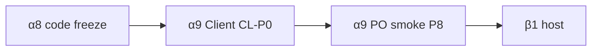

# Gap audit v4 ↔ v5 — SSOT luk behawioralnych

**Data:** 2026-07-20 (rewizja — α8 code freeze; residual → α9)  
**Repo v5:** `stagesync` · **Referencja v4:** `STAGESYNC-APP-LEGACY`  
**Polityka:** [ADR 0011](../../adr/0011-ui-parity-behavior.md) — parity = **zachowanie**, nie inventarz / clone chrome  
**Rola:** **SSOT luk** (P0/P1/P2). Inventarz wierszowy ([ui-diff](./report-v4-v5-ui-diff-inventory.md)) jest **wtórny**.  
**Freeze:** [report-alpha8-code-freeze.md](./report-alpha8-code-freeze.md)

**Powiązania:** [parity-audit A](./report-v4-v5-parity-audit.md) · [ui-diff B](./report-v4-v5-ui-diff-inventory.md) · [parity-blocker](./report-parity-blocker-alpha8.md)

---

## 0. Metodologia i korekta szacunku

| Zasada | Szczegół |
|--------|----------|
| Parity | Gest / workflow jak w v4 (w granicach jawnego OUT) — **nie** „jest przycisk” |
| Zakaz | Disabled stuby w chrome „na zapas” (inventarz-first) — brak funkcji = **brak UI** |
| Inventarz | Aktualizacja **po** geście; `[x]` ≠ green PO smoke |
| Class | `port-behavior` \| `bug` \| `inventarz-stub` \| `deferred` \| `OUT` |

### Nota o starym ~55–65%

Szacunek behawioru **~55–65%** w [report-v4-v5-parity-audit.md](./report-v4-v5-parity-audit.md) (§1) był **zbyt optymistyczny**. Audyt A/B liczył głównie „ścieżka kodowa wired” (Forma pencil, mapy, snap locator/loop) i **pomijał** sterowanie operatora:

- marquee / multi-select / multi-drag (TE-01…06),
- clipboard ⌘C/X/V/D (TE-08 / KB-*),
- Countdown drag długości + shift treści (TE-19/22),
- atrapy Admin Tr./Lead/Edycja (AD-01…03),
- głębokość treści Client (CL-01/04/05).

**Zrewidowany rząd wielkości (bez jawnego OUT):** **~35–45%** behawioru operacyjnego v4 — do czasu green PO smoke na P0. Po α8 TE-P0/CD **code** szacunek engineeringowy wyższy; **nie** bumpać β bez P8 + CL-P0.

---

## 1. Timeline edit (TE)

| ID | Gap | v4 (fakt) | v5 (fakt) | Sev | Class |
|----|-----|-----------|-----------|-----|-------|
| TE-01 | Marquee multi-select | Empty pointer drag → `#timeline-marquee` → `selectedIds` (`timeline.js` ~3614–3678, ~8376–8393) | **fixed** 2026-07-20 — marquee overlay (`--ss-*`) + hit-test → `selectedIds` | — | present |
| TE-02 | Empty click → deselect **+ locator** | Short marquee / empty → `setSelected(null)` + `setLocatorFromClientX` | **fixed** 2026-07-20 — short marquee = clear + locator | — | present |
| TE-03 | Forma/content multi-select set | `state.selectedIds` + `primaryId` | **fixed** 2026-07-20 — `clipSelection` (`selectedIds`/`primaryId`/lane) | — | present |
| TE-04 | Shift+click range (same lane) | `selectRangeTo(clipId)` | **fixed** 2026-07-20 — Forma/content + mapy | — | present |
| TE-05 | Cmd/Ctrl+click toggle | `toggleSelected` | **fixed** 2026-07-20 — Forma/content + mapy | — | present |
| TE-06 | Multi-drag same kind | `moveIds = [...selectedIds]` | **fixed** 2026-07-20 — `moveIds` + `moveClipsRigidDelta` | — | present |
| TE-07 | Alt/Option+drag copy | `optionCopy` + duplicate on drop | **ABSENT** | **P1** | port-behavior |
| TE-08 | Copy / Cut / Paste / Duplicate | ⌘C/X/V/D → clipboard API | **fixed** 2026-07-20 — in-app clipboard @ locator | — | present |
| TE-09 | Tool menu (`T`) | `openToolMenuAt(pointer)` | Tylko strip; brak menu | **P1** | port-behavior |
| TE-10 | Tool letters w menu | `Tools.BY_KEY` | **ABSENT** | **P2** | port-behavior |
| TE-11 | Zoom tool drag rect | `beginZoomRect` / `finishZoomRect` | **usunięte** z strip (suwaki + wheel) | — | out-forever |
| TE-12 | Ctrl+Alt temporary Zoom | `effectiveToolId` → zoom | **ABSENT** (brak tool zoom) | — | out-forever |
| TE-13 | Scissors: empty Forma | Empty → `findSectionAtAbs` split | Wymaga `selectedClipId` else no-op | **P1** | bug |
| TE-14 | Scissors empty content lanes | Vocal/chord/cue split on empty | Empty content scissors **ABSENT** | **P2** | port-behavior |
| TE-15 | Pencil overwrite + remnant | `insertClipRange` / remnant | `insertSpanOverwrite` — core OK | — | present |
| TE-16 | Content gap-seal (rest/N.C.) | `finalizeMoveOnsetBlocks` | Geometria no-overlap bez seal | **P1** | port-behavior |
| TE-17 | Subsection edit | Boundary + inspector | Ported (boundary + inspector) | — | present |
| TE-18 | Subsection scissors bez select | Insert boundary bez prior select | Zależne od TE-13 | **P1** | bug |
| TE-19 | Countdown: body/right-edge = length | Canvas drag + regen | **fixed** 2026-07-20 — body/right = length (snap bars) + inspector | — | present |
| TE-20 | CD left-edge toast | Toast on left resize | Komunikat na lewej krawędzi | — | present |
| TE-21 | CD digit / content regen | `regenerateCountdownContent` (persist `vl-cd-*`) | Digits **display-only**: `countdownDigitLabels` + Client merge; `scrubCountdownDigitClips` on migrate / CD resize (no persist) | — | present (PO 2026-07-20) |
| TE-22 | CD lengthen shifts content | `setCountdownLengthBeats` przesuwa post-CD | **fixed** 2026-07-20 — stretch shifts post-CD content | — | present |
| TE-23 | Drag first section → Intro gap | `insertGapSectionAfterCountdown` | Normal `moveClipNoOverlap` | **P1** | port-behavior |
| TE-24 | Forma move = section + following | `moveSectionsFromId` | Single-clip move only | **P1** | port-behavior |
| TE-25 | Clip collision no-overlap | Cover-delete / finalize | Shared `placeClipNoOverlap` — Forma OK | — | present |
| TE-26 | Undo restores selection | `selectionSnapshot` on stack | `draftHistory` = Project only | **P1** | port-behavior |
| TE-27 | Dblclick → inspector | `handleTimelineDoubleTap` | **ABSENT** | **P2** | port-behavior |
| TE-28 | Wand scoped to selection | `wandScopeSectionIds` | Rebuild whole Forma | **P1** | port-behavior |
| TE-29 | Wand menu keys 1/2/3 | `WAND_BY_KEY` | Menu UI only | **P2** | port-behavior |
| TE-30 | Audio lanes edit | Widoczne w 4.x | Ukryte → β2 | — | **OUT** |

---

## 2. Keyboard (KB)

Źródło v4: `timeline.js` ~9621–9889 · v5: `TimelineShell.tsx` keydown ~630–729.

| ID | Shortcut / temat | v4 | v5 | Sev | Class |
|----|------------------|----|----|-----|-------|
| KB-01 | ⌘/Ctrl+S save | ✓ | ✓ | — | present |
| KB-02 | Esc / `?` close help | ✓ | Brak w keydown | **P2** | port-behavior |
| KB-03 | Esc close overlays (vis / picker stack) | ✓ | Nie lustrzane | **P2** | port-behavior |
| KB-04 | `?` open help | ✓ | Tylko button | **P2** | port-behavior |
| KB-05 | `T` tool menu | ✓ | **ABSENT** | **P1** | port-behavior |
| KB-06 | Tool letters w menu | ✓ | **ABSENT** | **P2** | port-behavior |
| KB-07 | Wand Esc + 1/2/3 | ✓ | **ABSENT** | **P2** | port-behavior |
| KB-08 | Bare `W` → wand (+ menu?) | ✓ menu | Ustawia tool; menu? | **P2** | bug |
| KB-09 | Bare `Z` fit | ✓ | ✓ | — | present |
| KB-10 | ⌘←→ / ⌘↑↓ zoom | ✓ | ✓ | — | present |
| KB-11 | Delete selection (multi) | Multi | **fixed** 2026-07-20 — Delete usuwa cały `selectedIds` | — | present |
| KB-12 | ←→ nudge locator | ✓ | ✓ | — | present |
| KB-13 | Alt+←→ setlist | ✓ | ✓ | — | present |
| KB-14 | `[` / `]` setlist | ✓ | **ABSENT** | **P2** | port-behavior |
| KB-15 | Space play/pause | ✓ | ✓ | — | present |
| KB-16 | Space w Tap = vocal mark | Timeline Tap | Space = transport; Tap mark tylko Client | **P1** | port-behavior |
| KB-17 | Tap ↑ / ↓ / Esc | ✓ | **ABSENT** Timeline | **P1** | port-behavior |
| KB-18 | Bare `C` loop / `K` metro | ✓ | ✓ | — | present |
| KB-19 | ⌘Z / ⌘⇧Z / ⌘Y | ✓ | ✓ | — | present |
| KB-20 | ⌘C / ⌘X / ⌘V / ⌘D | ✓ | **fixed** 2026-07-20 — in-app clipboard | — | present |
| KB-21 | Ctrl/Meta+wheel (+ Alt/Shift) | ✓ | ✓ (2026-07-20) | — | present |
| KB-22 | Mobile edit key block | ✓ | Partial via touch tier | **P2** | deferred |

---

## 3. Chrome bez zgody PO (CH)

| ID | Issue | v4 | v5 | Sev | Class |
|----|-------|----|----|-----|-------|
| CH-01 | Footer Admin-like (Utwór/Pozycja/Stan) | Conn-dot + zoom | **fixed** 2026-07-20 → dot+zooms | **P2** | inventarz-stub *(anti-pattern; obecnie OK)* |
| CH-02 | Live playhead badge | `#live-badge` | **ABSENT** | **P2** | deferred |
| CH-03 | Odrzuć/Zapisz ikona→label | Ikony | **fixed** 2026-07-20 → ikony (fałszywe `keep-v5-ds`) | **P2** | inventarz-stub |
| CH-04 | Metro/Follow placement | Center cluster | **fixed** 2026-07-20 → center | **P2** | inventarz-stub |
| CH-05 | Zoom tool w strip | Aktywny drag | **usunięte** — suwaki H/V/UI + wheel | — | out-forever |
| CH-06 | Smart Tool extra | Brak w v4 strip | Extra v5 — OK jako delta DS | — | **OUT** (extra-v5) |

---

## 4. Admin (AD)

| ID | Gap | v4 (fakt) | v5 (fakt) | Sev | Class |
|----|-----|-----------|-----------|-----|-------|
| AD-01 | Transpozycja zespołu | Live Desk „Korekta na scenie” `#global-transpose` + API | **Brak UI** (2026-07-20: usunięto footer stub); API **ABSENT** → β2 | **P0** | deferred *(było inventarz-stub)* |
| AD-02 | Sync-lead | `#global-sync-lead` + `/api/sync-lead` | **Brak UI**; API **ABSENT** → β2 | **P0** | deferred |
| AD-03 | Edycja zdalna | `#client-edit-enabled` + `/api/client-edit` | **Brak UI**; API **ABSENT** → β2 | **P0** | deferred |
| AD-04 | Placement Live Desk vs footer | Kontrole w karcie Live Desk | Footer stuby **usunięte**; przywrócić tylko z prawdziwym Live Desk / API | **P1** | inventarz-stub *(zamknięte chrome)* |
| AD-05 | MIDI / Timeline bridge btn | Działający mostek | Footer disabled btn **usunięty**; Host stub „β2” OK | **P1** | **OUT** (β2) |
| AD-06 | Host MIDI I/O | Pełny monitor | Card „Host MIDI I/O — β2” | — | **OUT** |
| AD-07 | Sieć / klienci LAN card | Live Desk „Sieć i klienci” | Brak równoważnej karty (Scena = presence partial) | **P1** | port-behavior |
| AD-08 | Docker update | Historyczny update UI | Disabled ADR 0004 | — | **OUT** |
| AD-09 | Host .env MIDI fields | Live settings | Fieldset disabled w modalu | **P2** | **OUT** (β2) |

**Status Teraz / Sekcja / Pozycja / Dalej / Połączenie** — **zostają** (metryki operacyjne Live Desk, nie atrapy korekt).

---

## 5. Client (CL)

| ID | Gap | v4 (fakt) | v5 (fakt) | Sev | Class |
|----|-----|-----------|-----------|-----|-------|
| CL-01 | Karaoke beat / bar highlight | `highlightKaraokeBeat` | Line-level active only — **bez** beat fill | **P0** | port-behavior |
| CL-02 | Karaoke remote line edit | Textareas + shift gdy client-edit | Brak (zależne AD-03) | **P1** | port-behavior |
| CL-03 | Instrument pitch (C/B♭/E♭) | Global pitch toggle | **ABSENT** | **P1** | port-behavior |
| CL-04 | Grid: full cycle / multi-bar | `grid-cycle.js` | `GridPane` = current + upcoming strip | **P0** | port-behavior |
| CL-05 | Forma/drums bar progress | `drums-view.js` cells current/past | Section + notes — **bez** bar grid | **P0** | port-behavior |
| CL-06 | Score / OSMD sync | Pełniejszy sync | Stub lista MusicXML | **P1** | deferred / **OUT**(β+) |
| CL-07 | Score octave / part pitch | Score settings | **ABSENT** | **P2** | deferred |
| CL-08 | Stage cue overlay | cue-display | Present | — | present |
| CL-09 | Karaoke prefs vs treść | Settings + deep content | Prefs wired; treść = CL-01 | **P1** | port-behavior |
| CL-10 | Dual-role split | max 2 | Present | — | present |

---

## 6. Rollup P0 + kolejność fal

### P0 (blokuje scenę / edycję / β)

1. ~~**TE-01 / 03–06 / 08** + **KB-20** — marquee, multi-select, multi-drag, clipboard~~ **code** (α8 freeze; PO smoke α9)
2. ~~**TE-19 / 22** — Countdown canvas length + shift treści~~ **code** (α8 freeze; PO smoke α9)
3. **CL-01 / 04 / 05** — karaoke beat; grid cycle; Forma bar progress — **α9 must**
4. **AD-01–03** — Transpozycja / Lead / Edycja — **β2** (API + Live Desk; **nie** footer stub; **nie** bloker α9)

### Świadome OUT (nie liczyć do bramki)

Audio lanes · Host MIDI I/O · Docker update · OSMD pełny sync (β+) · Smart Tool extra · AD-01…03 (β2)

### Fale implementacji

| Fala | Zakres | Cel |
|------|--------|-----|
| Gap-audit + Admin stubs | SSOT luk + usunięcie footer atrap | **done** (α8 freeze) |
| **α8-TE-CD** | Countdown drag + content shift | **done** (code; PO smoke α9) |
| **α8-TE-P0** | Marquee + multi-select + multi-drag + clipboard | **done** (code; PO smoke α9) |
| **α9-CL-P0** | Karaoke beat / grid cycle / Forma bars | **open** |
| **α9-P8** | PO smoke T/A/C | **open** — bloker β |
| **β2** | AD-01…03 Live Desk + MIDI I/O + audio | Po host β1 |

---

## 7. Cross-link

- Część A (architektura): [report-v4-v5-parity-audit.md](./report-v4-v5-parity-audit.md)  
- Aneks inventarz: [report-v4-v5-ui-diff-inventory.md](./report-v4-v5-ui-diff-inventory.md)  
- Bramka: [report-parity-blocker-alpha8.md](./report-parity-blocker-alpha8.md)  
- Freeze: [report-alpha8-code-freeze.md](./report-alpha8-code-freeze.md)  
- Kontrakt: [ADR 0011](../../adr/0011-ui-parity-behavior.md) §4 — zakaz disabled-for-inventory.
